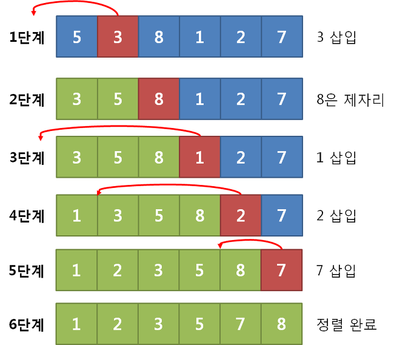
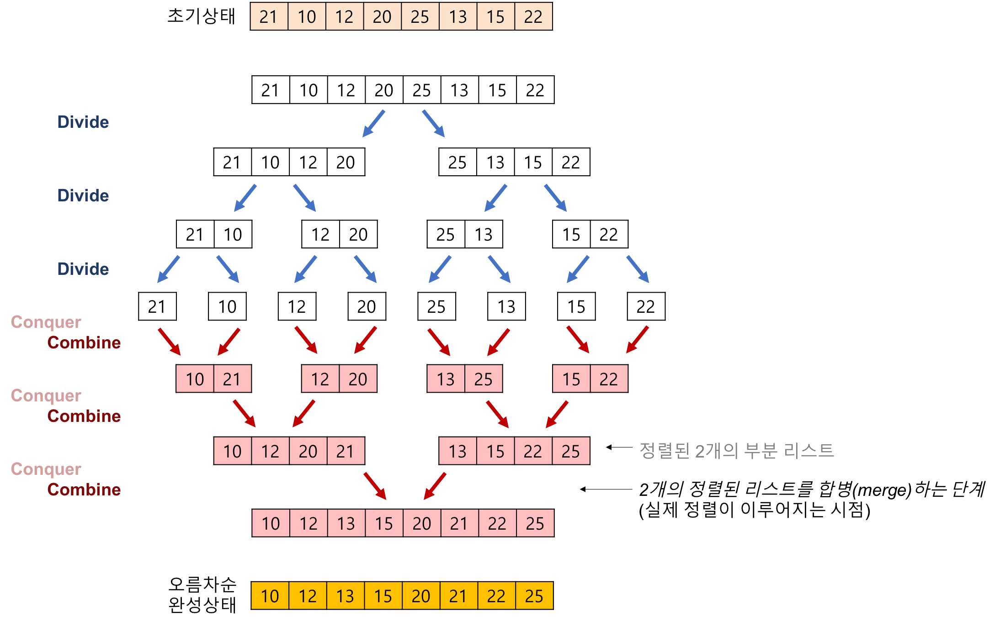

# Algorithm

- [정렬](#정렬)
  + [버블 정렬](#버블-정렬)
  + [선택 정렬](#선택-정렬)
  + [삽입 정렬](#삽입-정렬)
  + [쉘 정렬](#쉘-정렬)
  + [힙 정렬](#힙-정렬)
  + [합병 정렬](#합병-정렬)
  + [퀵 정렬](#퀵-정렬)
  + [기수 정렬](#기수-정렬)

## 정렬
### 버블 정렬

- 첫 번째 원소부터 인접한 원소끼리 계속 자리를 교환하면서 맨 끝부터 정렬하는 방식
- 첫번째 원소부터 마지막 원소까지 반복하여 한 단계가 끝나면 가장 큰 원소를 마지막 자리로 정렬
- 시간 복잡도: O(N^2)
- 코드
~~~java
int[] bubbleSort(int[] arr){
    int n = arr.length;
    for(int i=0; i<n; i++){
      for(int j=0; j<n - i; j++){
        if(arr[i] > arr[i+1]){
          int tmp = arr[i];
          arr[i] = arr[i+1];
          arr[i+1] = tmp;
        }
      }
    }

    return arr;
}
~~~

### 선택 정렬

- 앞에서부터 차례대로 정렬하는 방법
- 주어진 리스트 중 최소값을 찾고 그 값을 맨 앞에 위치한 값과 교체
- 시간 복잡도: O(N^2)
- 버블 정렬보단 값의 교환이 적음
- 이미 정렬된 상태에서 소수의 자료가 추가될 시 최악의 속도를 보여무
- 코드
~~~java
int[] selectionSort(int[] arr){
    int n = arr.length;
    for(int i=0; i<n-1; i++){
      int minNum = INF;//다 INF보다 작다고 가정
      int mIdx = -1;
      for(int j=i; j<n; j++){
        if(minNum > arr[j]){
          minNum = arr[j];
          mIdx = j;
        }
      }
      int tmp = arr[j];
      arr[j] = arr[i];
      arr[i] = tmp;  
    }
    return arr;
}
~~~

### 삽입 정렬

- 버블 소트의 비교 횟수를 효율적으로 줄이기 위해 고안
- 자료 배열의 모든 요소를 앞에서부터 차례대로 이미 정렬된 배열 부분과 비교, 자신의 위치를 찾아 삽입
- 거의 정렬되어 있을 시 효율이 좋음
- 시간 복잡도
  + 최선: O(N)
  + 최악: O(N^2)
- 코드
~~~java  
int[] insertionSort(int[] arr){
    int n = arr.length;
    for(int i=1; i<n; i++){
      int swp = arr[i];
      int j=0;
      while(j < i && arr[j] < swp){
        j++;
      }
      if(j != 0){
        int tmp = arr[j-1];
        arr[j-1] = arr[i];
        arr[i] = arr[j-1];
      }
    }
    return arr;
}
~~~

### 쉘 정렬

- 삽입 정렬의 단점을 보완해서 만든 정렬법
- 정렬해야 할 리스트의 K번째 요소를 추출해서 각각 부분 리스트르 만들고 이를 삽입 정렬 실시, 회전마다 K를 반으로 줄여서 1이 될 때까지 반복
- 멀리 있는 레코드들끼리 비교 및 교환 가능
- 시간 복잡도
  + 보통: O(N^1.5)
  + 최악: O(N^2)
- 코드
~~~java
~~~

### 힙 정렬

- 최대/최소 힙 트리를 구성해 정렬
- 최소 힙 기준, 맨 위의 원소가 가장 작은 값을 가지며, 부모 노드가 자식 노드보다 작은 값을 가지고 있어야 함
- 추가적인 메모리가 필요없음
- 퀵 정렬보단 성능이 떨어진다고 함
- 우선순위 큐 등에 사용
- 시간 복잡도: O(NlogN)

### 합병 정렬

- Divide and Conquer 방식을 이용해 정렬
- 계속 데이터 절반을 쪼개서 분할한 후, 병합 시에 정렬.
- 시간 복잡도: O(NlogN)
- 정렬을 위해 데이터 전체 크기만한 메모리가 더 필요
- 코드
~~~java
~~~

### 퀵 정렬

- 기준 값(Pivot)을 이용해 분할을 진행하는 정렬 방식
- 처음 하나의 축을 먼저 정해 이 축의 값보다 작은 값을 왼쪽, 큰 값을 오른쪽에 위치시킨 뒤 왼,오른쪽 수들은 다시 각각의 공간으로 나눠져 공간 크기가 1이 될 때까지 정렬
- 시간 복잡도
  + 평균: O(NlogN)
  + 최악: O(N^2)
- 최악의 경우가 되는 경우가 거의 없는지라, 가장 많이 사용되는 정렬 알고리즘
- 코드
~~~java
static void quickSort(int[] arr, int start, int end){
		System.out.println(start + "~" + end);
	    if(start + 1 >= end) return;//만약 범위가 1 or 0면 종료

	    int pivot = arr[start];//pivot을 첫번째 원소로 잡음
	    int low = start + 1;//start 다음을 처음
	    int high = end - 1;//end는 닿지 않는 곳, -1 해줌

	    while(low <= high){//교차할 때까지
	      while(low < end && arr[low] <= pivot){
	        low++;
	      }//pivot보다 큰 지점
	      while(high > start && arr[high] >= pivot){
	        high--;
	      }//pivot보다 작은 지점

	      if(low <= high){
	        int tmp = arr[low];
	        arr[low] = arr[high];
	        arr[high] = tmp;
	      }//교차 안했으면 교체
	    }

	    int tmp = arr[start];
	    arr[start] = arr[high];
	    arr[high] = tmp;

	    quickSort(arr, start, high);
	    quickSort(arr, high+1, end);
}
~~~

### 기수 정렬

- 자리수가 있는 데이터에 대해 각 자리 수를 기준으로 하나씩 정렬 진행
- 시간 복잡도: O(dN)
- 버킷이란 추가 메모리 필요
- 데이터 타입 일정한 경우에만 가능
