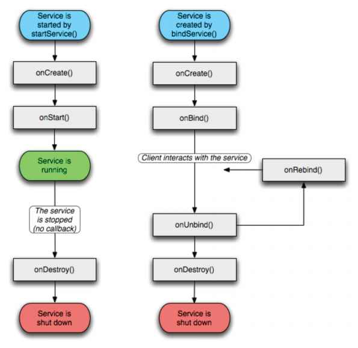

# Android

- [Manifest 파일](#Manifest-파일)
- [4대 컴포넌트](#4대-컴포넌트)
- [LifeCycle](#LifeCycle)
  + Activity
  + Fragment
- [Fragment](#Fragment)
  + Activity와 비교했을 때 장단점
- [Service](#Service)
- [DP/DPI/PX](#DP/DPI/PX)
- [Coroutine](#Coroutine)
  + Thread vs Coroutine
  + Handler / Looper
- [Room](#Room)
- [Retrofit](#Retrofit)
- [Glide](#Glide)
- [그외 나올만한 Android 질문 정리](#그외-나올만한-Android-질문-정리)

## Manifest 파일
- 앱에 대한 필수적인 정보를 안드로이드 Build Tool 및 Android OS, 그리고 구글 플레이에 제공하는 역할

### 필수 선언 정보
1. 앱의 패키지 이름
- 용도
  + 앱 리소스에 접근하는데 사용되는 R클래스 네임 스페이스
  + Manifest 파일 내에 선언된 상대 경로에 적용
    * <activity android:name=".MainActivity> 라고 선언했다면 이는 "com.ready.example.MainActivity" 를 가리킴
2. 앱 컴포넌트들
- Activity
- Service
- Broadcast Receiver
- Content Provider
3. 권한
- 특정 시스템 기능을 사용할 때 요청하는 것
4. 디바이스 특징
- 앱이 필요로 하는 하드웨어 또는 소프트웨어 특징 명시
- <uses-feature> 태그를 사용하면 명시
- ex) 카메라 있는 기기에서만 다운로드 될 수 있게 설정 가능

## 4대 컴포넌트

- 각 컴포넌트의 경우 독립적인 형태로 존재하며 고유의 기능을 가짐
- 각 컴포넌트들은 Intent를 통해 상호작용을 함

### Activity
- **사용자와 상호작용**을 담당하는 인터페이스
- 사용자가 애플리케이션과 상호작용하는 단일화면(UI)
- 생명 주기(Life Cycle) 관련 메서드들을 재정의 가능

  + Intent를 통해 다른 액티비티 호출 가능
  + 2개 이상의 액티비티 동시 Display 할 수 없음
  + 1개 이상의 View/ViewGroup을 포함
  + 애플리케이션에 무조건 1개 이상 존재해야 함
  + Fragment를 추가해서 액티비티 내의 화면을 분할시킬 수 있음

### Service
- **Background에서 특정 작업을 처리**하기 위해 사용하는 컴포넌트
- 음원 스트리밍 노래를 들으면서 작업을 한다던가 등의 2개 이상의 작업을 동시에 해야 할 때 서비스 사용
- **UI Thread에서 동작**, 별도 Thread를 생성해서 작업을 처리해야함
  + 네트워크 연동 가능
  + 별도 UI를 가지지 않고 Notification을 통해서 UI 표현 가능
  + 애플리케이션이 종료되도 이미 시작이 된 서비스는 Background에서 계속 동작

### Broadcast Receiver
- **안드로이드 OS로부터 발생하는 다양한 이벤트를 받아와 핸들링**하는 컴포넌트
- 앱 초기화, 네트워크 끊김, 문자 수신 등의 정보를 처리해야 할 필요가 있을 때 동작
- 이러한 메세지들을 받기 위해 리시버 구현 시 특정 이벤트 처리 가능

  + 대부분 UI가 없음
  + 디바이스의 특수 상황에 대응하기 위해 사용
  + 특정 상황을 제외하고 시스템에서 시작

### Content Provider
- **데이터 관리 및 다른 애플리케이션의 데이터 제공**
- DB를 공유하기 위해 사용하며 애플리케이션 간 데이터 공유를 위해 표준화된 인터페이스 사용

  + SQLite DB/Web/파일 입출력을 통해 데이터 관리
  + 외부에서 실행 애플리케이션 내의 DB에 접근을 차단하면서 공유하고 싶은 데이터만 공개할 수 있게 도와줌
  + **용량이 큰 데이터**(음악, 사진 등)을 공유하는데 적합
  + **Content Resolver**를 통해 Content Provider에 접근
  + 데이터 Read/Write 권한을 획득해야 애플리케이션 접근 가능
  + CRUD(Create, Read, Update, Delete) 원칙 준수

### Intent
- 컴포넌트 간 작업 수행을 위한 **정보 전달 통신수단**
- 다른 컴포넌트에 액션, 데이터 전달
- 인텐트를 통해 다른 애플리케이션의 컴포넌트 활성화 가능

## LifeCycle
- 사용자가 앱을 탐색하고, 나가고, 다시 돌아오는 등 행동에 따라 서로 다른 상태로 전환
- 이러한 활동을 알아차릴 수 있는 여러 콜백 제공
- 이를 제어함으로써 비정상 종료 및 상태가 저장되지 않는 문제를 해결 가능

### Activity

1. OnCreate()
- 시스템이 먼저 활동 생성 시 실행되는 것
- ViewModel과 연결 및 데이터 목록 바인딩

2. onStart()
- 액티비티가 사용자에게 표시되기 직전에 호출
- 앱이 UI를 관리하는 코드 초기화

3. onResume()
- 액티비티가 사용자와 상호작용할 때 호출
- 앱에서 포커스가 떠날 때까지 이 상태에 머무름

4. onPause()
- 활동이 포그라운드에 있지 않게 될 때 호출
- 배터리 수명에 영향을 미칠 수 있는 리소스 해제 가능
- 아주 잠깐 실행되므로 저장 작업에 시간이 부족

5. onStop()
- 활동이 사용자에게 더이상 표시되지 않으면 호출
- 화면에 보이지 않을 때 실행할 필요가 없는 기능 정지 가능
- CPU를 비교적 많이 소모하는 종료 작업 실행에 적합
- 여기서 화면이 다시 나타난다면 onRestart() 호출, 이후 onStart()부터 다시 호출

6. onDestroy()
- 활동이 소멸되기 전에 호출
- finish() 또는 구성 변경(기기 변경이나 멀티윈도우)로 인해 시스템이 일시적으로 활동이 소멸되는 경우 호출

#### onSaveInstanceState() / onRestoreInstanceState()
* 활동 정지 및 복구 시 상태 정보를 저장하는 메서드
* onSaveInstanceState()는 onPause() 이전에 호출
* onRestoreInstanceState()는 onStart() 직후에 호출

### Fragment

1. onAttach()
- Activity에 붙을 때 처음 호출

2. onCreate()
- 초기화해야 하는 리소스를 초기화 및 Fragment 생성
- UI는 여기서 초기화되지 않는다.

3. onCreateView()
- Fragment의 View가 생성되는 부분
- Layout을 inflate하는 부분

4. onViewStateRestored()
- Activity의 onCreate() 이후 호출
- Activity 및 Fragment 뷰가 모두 생성된 상태로, view를 변경 가능하게 함

5. onStart()
- 유저에게 Fragment가 보이기 직전 호출
- Activity onStart() 한 이후 호출

6. onResume()
- 유저와 상호작용하기 직전에 호출

7. onPause()
- Focus를 잃은 상태에서 호출, background 상태

8. onStop()
- 화면이 완전히 가려질 시 호출
- 해당 액티비티를 재호출시 복원이 가능한 상태

9. onSaveInstanceState()
- 간단하고 가벼운 UI 상태를 저장
- API 28+에만 onStop() 이후 생성, 이전 API는 onStop() 이전에 생성

9. onDestroyView()
- Fragment 관련 View 제거 때 호출

10. onDestroy()
- 완전히 종료

11. onDetach()
- Activity로부터 Fragment 해제 때 호출

### Activity

## Fragment
- 하나의 Activity가 여러개의 화면을 가지도록 고안된 View
- 특징
  + 액티비티를 분할해 화면의 한 부분 정의
  + 다른 액티비티에서도 사용 가능
  + layout, 동작 처리, 생명주기를 가지는 독립적 모듈

### Activity와 비교할 시 장단점
- 장점
  + Activity에 비해 상대적으로 가벼움
  +

## Service
- 백그라운드에서 실행되는 동작이 필요할 때 사용.
- LifeCycle

- onCreate(): 최초에 한번만 실행
- **onStartCommand()**: 다른 컴포넌트에서 startService() 호출 시 이 메서드 호출, 서비스 호출할 때마다 실행
- onDestroy(): 서비스 종료 시 실행

~~~kotlin
override fun onStartCommand(intent: Intent, flags: Int, startId: Int): Int {
  Log.d("test", "서비스의 onStartCommand");
  mp.start(); // 노래 시작
  return super.onStartCommand(intent, flags, startId);
}
~~~
- bindService(): 서비스와 액티비티가 서버-클라 역할을 하게 작동, service 내의 onBind()가 호출
- Notification
  + Notification Channel을 통해 Notification을 여러가지 용도로 나눠서 관리
  + Android 8.0 이상은 무조건 Channel을 만들어줘야 한다.
  + mediaSession: Notification의 control 담
  + 코드 예시
~~~kotlin
val notification = notificationBuilder
            .setSmallIcon(R.drawable.ic_music_note)
            .setContentTitle(activeMusic.songName)
            .setContentText(activeMusic.singerName)
            .setLargeIcon(albumImage)
            .addAction(notificationAction, "pause", actionIntent)
            .setStyle(androidx.media.app.NotificationCompat.MediaStyle()
                .setShowActionsInCompactView(0)
                .setMediaSession(mediaSession.sessionToken))
            .setPriority(NotificationCompat.PRIORITY_LOW)
            .setAutoCancel(false)
            .setOngoing(true)
            .build()
notification.flags = FLAG_ONGOING_EVENT
notificationManager.notify(NOTIFICATION_ID, notification)//실제 등록
~~~

- Notification : https://gun0912.tistory.com/77
- Service 바인딩: https://bitsoul.tistory.com/149

## Coroutine
### 코루틴이란?
+ **협력형 멀티태스킹**
+ 동시성 프로그래밍 지원
+ 비동기 처리를 쉽게 도와줌

### 간단한 설명
+ Co + routine
+ 보통 함수는 메인 루틴 및 서브 루틴으로 나뉘며 서브루틴은 1개의 입구 및 1개의 출구를 가짐
+ 코루틴 함수는 꼭 return 또는 닫는 괄호를 만나지 않더라도 **중간에 나갈 수 있음**.

### 동시성 프로그래밍
- 각자 다른 코드에 대해 조금씩 왔다갔다하면서 실행하는 개념
- 아예 똑같이 수행한는 병렬성 프로그래밍과 다른 개념

### Threading vs Coroutine
- 공통점: 동시성(Concurrency) 보장
- Threading
  + Stack 영역에 적재
  + OS Kernel을 통한 context switching을 통해 동시성 보장
  + Blocking을 통해 다른 작업이 끝날 때 까지 스레드가 사용하지 못하게 방지
- Coroutine
  + Heap 영역에 적재
  + 코딩을 통해 switching 시점을 정할 수 있음
  + suspend될 시 실제로 스레드가 완전 Block된것이 아니기 때문에 같은 스레드에 다른 작업을 하는 것이 가능
  + 다수 스레드가 동시에 수행된다면 context switching이 자주 일어나므로 단일 스레드에서 여러 coroutine object를 실행하는 것이 바람직

### 문법
- GlobalScope: 프로그램 어디서나 제어 및 동작이 가능한 기능 범위
- CoroutineScope: 특정 목적의 Dispatcher를 지정, 제어 및 동작이 가능한 범위
  + Dispatcher.Default – 기본적인 백그라운드 동작
  + Dispatcher.IO – I/O 최적화
  + Dispatcher.Main – UI 스레드에서 동작
- launch: 반환값이 없는 Job 객체
- async: 반환값이 있는 deffered 객체
- runblocking: 코루틴 함수가 종료될 때까지 메인 루틴을 잠시 대기
- delay(millisecond: Long): 루틴 잠시 대기
- Job.join(): Job의 실행이 끝날때까지 대기
- Deffered.await(): defferd 실행이 끝날때까지 대기, 결과도 반환
- cancel(): delay() 또는 yield()함수가 사용된 위치까지 수행된 뒤 종료
suspend: suspend를 만나면 더 이상 아래 코드가 실행되지 않고 block 탈출

- 참고: https://aaronryu.github.io/2019/05/27/coroutine-and-thread/

### Handler/Looper
- Thread 백그라운드 처리에 사용

#### Handler
- Handler는 Message 및 Runnable 객체 처리
- Runnable은 run() 메서드로 처리, Message는 handleMessage() 메서드로 처리
- Handler는 **의존적**. Message Queue 및 Looper가 필요

#### Looper
- 하나의 Looper는 하나의 스레드만 담당
- 메세지가 들어오면 이 메세지를 꺼내 적절한 Handler로 전달

#### 동작 과정

1. Handler.sendMessage()를 통해 Message Queue에 저장
2. Looper는 Message Queue에서 Loop()를 통해 반복 처리할 메세지를 Handler에 전달
3. Handler는 handlerMessage를 통해 처리

## Room
- **앱으로부터 SQLite를 편리하게 사용할 수 있도록 하는 안드로이드 아키텍쳐 컴포넌트**
  + SQLite: 안드로이드에 기본 탑재된 내부 DB
  + 장점
    * 크기가 작음
    * 오픈 소스
    * **로컬**에서의 간단한 DB 구성
- 객체와 관계형 DB를 매핑(ORM)
- 구성 요소

1. Entity: **DB 내의 테이블**, DB에 저장할 데이터 형식 정의
2. DAO(Data Access Object): DB에 접근하여 **수행할 작업**을 메소드 형태로 정의
3. Room Database: **DB의 전체적인 소유자** 역할, DB를 생성 및 버전 관리

- SQLite DB 라이브러리와 비교 장점
1. 컴파일 도중 SQL에 대한 유효성 검사 기능
2. Schema가 변경 시 자동 업데이트
3. 데이터 객체 변경을 위해 ORM 라이브러리 통해 매핑
4. LiveData 및 RxJava/Coroutine을 이용해 생성 가능

- 구현 코드
1. Entity
~~~java
@Entity(tableName = "Raid")
data class Raid (
        @PrimaryKey(autoGenerate = true) var raidId: Int,
        @ColumnInfo(name = "raidName") var raidName: String,
        @ColumnInfo(name = "raidThumbnail") var raidThumbnail: String,
        @ColumnInfo(name = "startDate") var startDate: Date,
        @ColumnInfo(name = "endDate") var endDate: Date,
        @Ignore var bosses : List<BossInRaid>
        ){
        constructor(raidName: String, raidThumbnail: String, startDate: Date, endDate: Date) :
                this(0, raidName, raidThumbnail, startDate, endDate, Collections.nCopies(4, BossInRaid()))
}
~~~
2. Dao
~~~java
@Dao
interface RaidDao {
  @Query("SELECT * FROM Raid")
    fun getAll(): List<Raid>

    @Query("SELECT * FROM Raid WHERE raidId IN (:raidIds)")
    fun loadAllByIds(raidIds: IntArray): List<Raid>
}
~~~
3. Room
~~~java
@Database(entities = [
    Raid::class], version = 1, exportSchema = false)
@TypeConverters(DataConverter::class)
abstract class AppDatabase : RoomDatabase() {
    abstract fun raidDao(): RaidDao

    companion object {
        private var INSTANCE: AppDatabase? = null

        fun getInstance(context: Context): AppDatabase? {
            if (INSTANCE == null) {
                synchronized(AppDatabase::class) {
                    INSTANCE = Room.databaseBuilder(context.applicationContext,
                            AppDatabase::class.java, "database")
                        .createFromAsset("database/database.db")
                        .allowMainThreadQueries()
                        .build()
                }
            }
            return INSTANCE
        }
    }
}
~~~

## Retrofit
- TypeSafe한 HttpClient 라이브러리
  + 네트워크로부터 전달된 데이터를 App에서 필요한 형태의 객체로 받을 수 있음
- 사용하는 이유
  + HTTP 개발 시 **연결, 캐싱, 실패 요청 재시도, 스레딩, 응답 분석, 오류 처리** 등을 고려해야 됨
  + 이를 Retrofit는 다 처리해준다!

- 필요 코드
1. API Interface: 어떠한 요청을 보낼 것인지에 대한 메서드 정의
2. Retrofit 객체: client 지정 및 보낼 주소, 데이터 파싱 라이브러리 등 추가
3. 이들을 이용해 call.enqueue 로 요청을 보내고 response를 받음

## Glide
- 이미지 로딩 라이브러리
- gif, video 로딩 가능
- 빠른 로딩을 위해 내부적으로 cache를 가짐
- httpUrlConnection 라이브러리 기반
- 구조

1. 요청 데이터가 캐시 메모리에 저장되어있는지 확인. 한번 이상 로딩 시 캐시에 저장되어 빠르게 이미지 로딩 가능
2. 캐시에 저장되어있지 않을 시 Disk에서 확인, 여기서도 없으면 network 통신을 통해 얻어올 수 있음

- Cache 관리
  + skipMemoryCache(Boolean) : 로딩한 데이터를 캐시에 저장할지 여부를 판단
  + diskCacheStrategy(DiskCacheStrategy) : 디스크 캐시 수행
    * DiskCacheStrategy.None: 디스크 캐싱을 안함
    * DiskCacheStrategy.SOURCE: 원본 이미지 캐싱
    * DiskCacheStrategy.RESULT: 변형된 이미지 캐싱
    * DiskCacheStrategy.ALL: 모든 이미지 캐싱(기본)

- 사용법
~~~java
ImageView imageView = findViewById<>(R.id.image) // 이미지 뷰

Glide.with(this).load("이미지 url...").into(imageView)
~~~

- 대표적인 함수
  + override(): 이미지를 지정한 크기만큼 불러온다. 공간 절약에 사용
  ~~~java
  Glide.with(this)
    .load("이미지 url...")
    .override(이미지 사이즈) // ex) override(600, 200)
    .into(imageView)
  ~~~
  + placeholder(): 이미지 로딩 중에 보여질 이미지를 정한다.
  ~~~java
  Glide.with(this)
    .load("이미지 url...")
    .placeholder(로딩 이미지) // ex) placeholder(R.drawable.loading)
    .into(imageView)
  ~~~
  + error(): 로딩 실패 시 보여줄 이미지를 정한다.
  ~~~java
  Glide.with(this)
    .load("이미지 url...")
    .error(실패 이미지) // ex) error(R.drawable.error)
    .into(imageView)
  ~~~
  + asGif(): GIF 이미지 로딩
  ~~~java
  Glide.with(this)
    .load("이미지(GIF) url...")
    .into(imageView)
    .asGif()
  ~~~

- vs Picasso
  + Picasso는 Bitmap 포맷을 **ARGB_8888**로 사용하고 Glide는 Bitmap포맷을 **RGB_565**를 사용
    * RGB_565은 8888에 비해 화질은 떨어지지만 메모리 용량 50% 적게 사용
  + Picasso는 **원본 이미지**를 메모리를 가져온 후에 GPU에 실시간 Resizing, Glides는 ImageView에 맞는 사이즈를 가져와 ImageView에 할당
    * 만약 같은 이미지를 다른 사이즈로 여러번 로드한다면 Glide는 계속 다운로드 해야됨
    * 대신 메모리 사용량이 적음  

## 그외 나올만한 Android 질문 정리
- SharedPreference: 복잡한 자료가 아닌 액티비티나 애플리케이션 등에서 사용하는 간단한 설정 값 등을 저장할 때 사용. 이를 이용해 간단한 변수를 액티비티 간에 전달도 가능
- ANR: Application Not Responding
  + 메인 스레드가 일정 시간 어떤 Task(이벤트: 5초, BroadcastReceiver: 10초)에 잡혀 있을 시 발생
  + 예방 방법
  1. 시간 소모가 많은 작업은 스레드로 처리
  2. 사용자에게 progressBar등을 이용해 작업 진행과정 알리기
- Vector과 Bitmap 이미지 차이
  + Vector: 특정 해상도에 제한되지 않고 리사이징 되어도 깨지지 않는 이미지. Ex) SVG
  + Bitmap: 픽셀로 구성, 특정 해상도에 제한됨. Ex) PNG, JPEG
- Android Jetpack: 안드로이드 앱을 구축하는데 도움을 주는 라이브러리 모음, Room 등이 여기에 포함
- Context: 애플리케이션 환경에 대한 글로벌 정보를 가지는 인터페이스
  + Application Context: 싱글톤 오브젝트 생성 시 필요
  + Activity Context: Activity 내에 유효한 Context
- LayourInflator: XML로 정의된 자원들을 View형태로 바꿔주는 역할
- Activity Stack: LIFO 구조로 Activity가 새로 호출될 때마다 쌓이는 Stack
  + 관리 방법
  1. LaunchMode 옵션
    * standard: 여러 번 인스턴스 화 및 서로 다른 작업에 속함
    * singleTop: 활동 인스턴스가 이미 현재 작업의 맨 위에 있으면 새로 올리지 않고 기존 인스턴스로 라우팅
    * singleTask: 활동의 인스턴스가 Stack의 맨 아래에만 존재할 수 있음, 다른 액티비티를 쌓을 수 있다.
    * singleInstance: 활동은 항상 자체 작업의 단 하나의 유일한 멤버, 다른 액티비티를 못 쌓음
  2. Intent Flag
    * FLAG_ACTIVITY_NEW_TASK: 위의 singleTask와 유사, 활동을 새 작업에서 시작
    * FLAG_ACTIVITY_SINGLE_TOP: singleTop과 유사, 새로 부른 인스턴스가 가장 top에 있다면 기존 인스턴스 호출
    * FLAG_ACTIVITY_CLEAR_TOP: 새로 부른 인스턴스가 이미 stack에 존재하면 그 인스턴스가 top이 될 때까지 스택 pop
