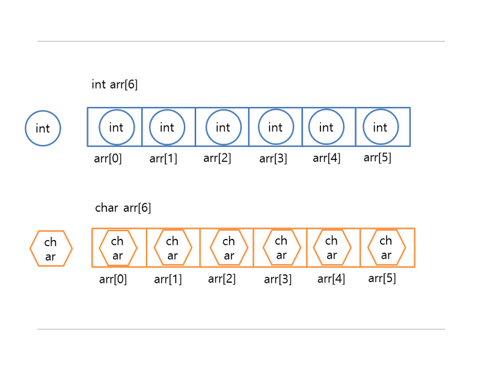
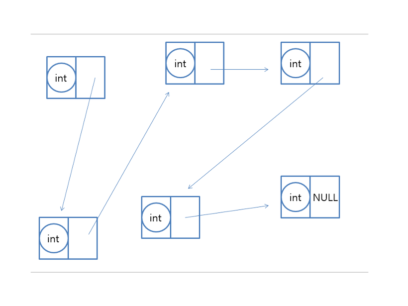
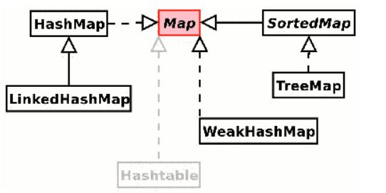
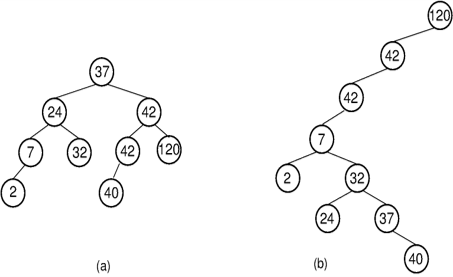
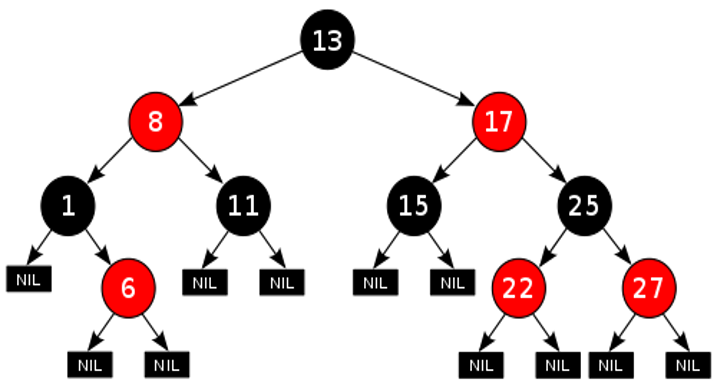
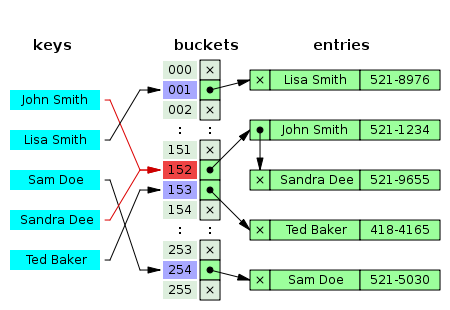

# Database

- [배열 vs 연결리스트](#배열-vs-연결리스트)
- [스택 vs 큐](#스택-vs-큐)
- [맵 vs 해쉬맵](#맵-vs-해쉬맵)

## 배열 vs 연결리스트
### 배열

- 같은 자료형을 가진 변수를 하나로 나타낸 것
- 연속된 메모리 공간으로 이뤄져 있는 자료구조
- Index를 이용해 표현, 지역성을 가짐
- 정적 표현
- 장점
  + 인덱스를 통한 검색 용이
  + 메모리 관리가 편함
- 단점
  + 한 데이터를 삭제해도 배열은 연속해야 하므로 공간이 남음 -> 메모리 낭비
  + 배열 크기를 컴파일 이전이 정해줘야 함
  + 컴파일 이후 배열 크기 조절 불가

### 연결리스트

- 순서가 있는 데이터 집합
- 불연속적으로 메모리 공간 차지
- Index를 가지지 않으며 순차성을 가지지 않음
- 동적 표현, 빈 Element는 허용하지 않음
- 장점
  + 삽입 및 삭제가 용이
  + 크기가 정해져있지 않아 메모리 재사용에 편리
- 단점
  + 검색 성능이 안 좋음
  + 포인터 통해 다음 데이터를 가리키므로 추가적인 메모리 공간 필요
- 코드 구현

~~~java
public class LinkedList<T>{  
  class Node{
    T data;
    Node next;

    Node(T d){
      data = d;
      next = null;
    }
  }

  Node head;
  Node tail;
  LinkedList(){
    head = null;
    tail = null;
  }

  public void insert(T data){
    Node newNode = new Node(data);
    if(head == null){
      head = newNode;
      tail = newNode;
    }
    else{
      tail.next = newNode;
      tail = newNode;
    }
  }

  public void remove(int idx){
    Node prev = null;
    Node del = head;
    while(idx > 0){
      prev = del;
      del = del.next;
      idx--;
    }
    if(del == head){
      head = head.next;
    }
    else if(del == tail){
      tail = prev;
    }
    if(prev != null) prev.next = del.next;
    del = null;
  }
}
~~~

## 스택 vs 큐
### 스택
- 정해진 방향으로만 쌓을 수 있는 LIFO 구조
- push / pop / top
- 웹 브라우저 뒤로가기, 역순 문자열, 실행 취소 등에 사용
- 코드
~~~java
public class Stack<T>{
  List<T> stack;
  Stack(){
    stack = new ArrayList<>();
  }

  public void push(T n){
    stack.add(n);
  }

  public T pop(){
    T last = stack.get(stack.size() - 1);
    stack.remove(stack.size() - 1);
    return last;
  }

  public T peek(){
    T last = stack.get(stack.size() - 1);
    return last;
  }

  public boolean isEmpty() {
    return stack.isEmpty();
  }
}
~~~

### 큐
- 삽입은 앞쪽, 삭제는 뒤쪽에서 이뤄지는 FIFO 구조
- offer / poll / element
- 시간 순서대로 처리해야 할때 사용
- 우선순위, 은행 업무 등등...
~~~java
public class Queue<T>{
  List<T> queue;
  Queue(){
    queue = new ArrayList<>();
  }

  public void offer(T n){
    queue.add(n);
  }

  public T poll(){
    if(queue.isEmpty()) return null;
    T first = queue.get(0);
    queue.remove(0);
    return first;
  }

  public T element(){
    if(queue.isEmpty()) return null;
    T first = queue.get(0);
    return last;
  }

  public boolean isEmpty() {
    return queue.isEmpty();
  }
}
~~~

## 맵 vs 해쉬맵

- 특정 키(key)에 대한 값(value)을 찾는데 사용하는 자료구조

### Map
- 인터페이스
- Binary Serach Tree 알고리즘 중에서도 Red-Black-Tree 사용
- O(logN) 보장
- 자료의 정렬 보장

#### Binary Search Tree

- 기준 노드 왼쪽은 항상 기준보다 작은 값, 오른쪽은 항상 큰 값이 저장
- 탐색/삽입/삭제 최악 시간 복잡도: O(n)
- (b)와 같이 편향된 트리가 생성될 경우 탐색/삽입/삭제가 상당히 비효율적으로 변함

#### Red Black Tree

- 기존 BST의 편향 문제를 해결하고 Balanced Search Tree를 보장하기 위해 만들어진 Tree
- 시간 복잡도: O(logN)
- 조건
  1. 모든 노드는 Red 또는 Black
  2. Root 노드 및 Leaves(Leaf 노드 밑 가상의 노드)는 Black
  3. 하나의 노드가 Red라면 이 노드의 부모 노드는 무조건 Black
  4. 어느 하나의 노드로부터의 서브 트리는 무조건 같은 개수의 Black 노드 개수를 가짐
- Balanced Tree 보장을 위해 삽입 및 삭제 시 위의 조건을 충족시키지 못한다면 회전을 통해 위 조건 맞을 때 까지 반복

### HashMap
- Map 인터페이스의 구현체 중 하나
- Hash Table을 이용해 키-값 관계 유지
- 이상적일 때 O(1), Collision이 많이 일어난다면 최악 O(N)
- 정렬이 보장되지 않음

#### Hash Table

- 하나의 Key에 대해 Hash Function을 이용해 Key에 대응하는 index를 골라 Hash Table(buckets)에 저장해주는 방식
- Index가 겹칠 시 Collision 발생
- Collision 해결 방법
1. Open Addressing

- Collision 발생 시 빈 곳을 발견할 때 까지 조사
- 이 때 Hash Function을 통해 조사
- Hash Function 종류
  + Linear Probing(선형 탐색): 다음 해시(+1)나 n개(+n)을 건너뛰어 비어있는 해시에 저장
  + Quadratic Probing(제곱 탐색): 충돌이 일어난 해시의 제곱을 한 해시에 데이터 저장
  + Double Hashing(이중 해시): 서로 다른 해시 함수를 중첩 적용한 해시에 데이터 저장
- 장점
  + 또 다른 저장공간 및 이에 대응하는 추가작업이 필요 없음
- 단점
  + 해시 함수 성능에 따라 전체 성능이 바뀜
  + 데이터 길이가 늘어나면 저장 공간이 추가로 필요

2. Chaining

- Collision 발생 시 같은 인덱스를 가지는 부분에 linked-list 또는 Tree 형태로 추가
- Java8에선 Self-Balancing BST로 구현
- 탐색 복잡도: O(1+a)
- 장점
  + 해시 테이블의 확장이 필요없음
  + 간단 구현
  + 손쉽게 삭제 가능
- 단점
  + 동일 버킷에 chaining되는 데이터가 많아지면 캐시 효율성 감소
