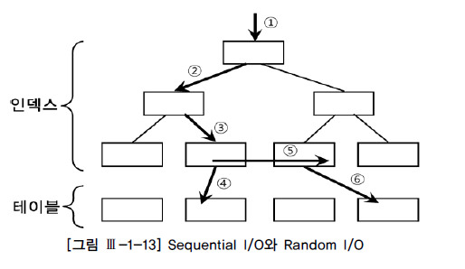
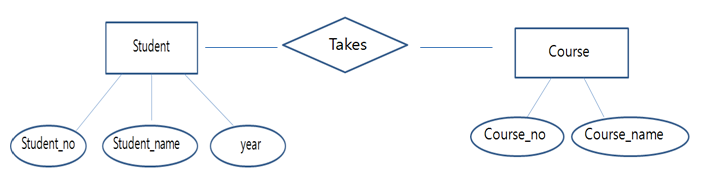
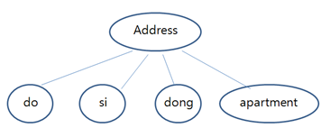
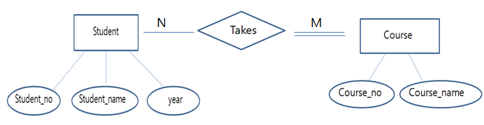
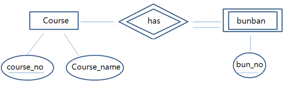
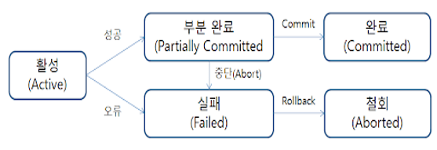
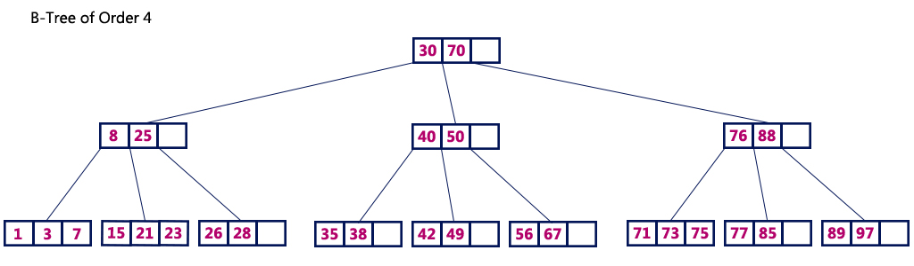
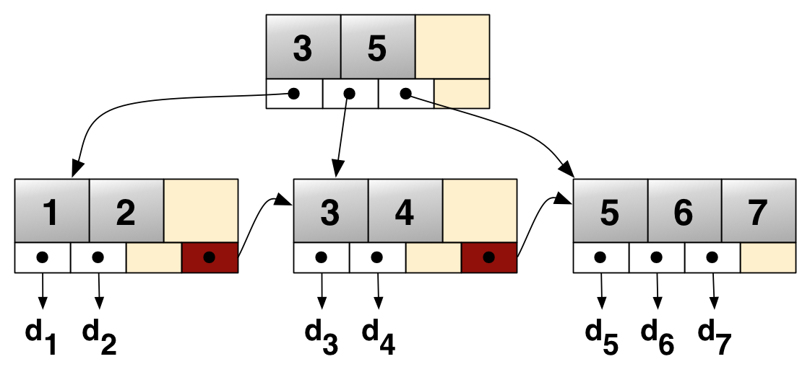

# Database
- [데이터베이스](#데이터베이스)
- [E-R 모델](#E-R-모델)
- [DB Join](#DB-Join)
- [트랜잭션](#트랜잭션)
- [DB 인덱스](#DB-인덱스)
- [RDBMS vs NoSQL](#RDBMS-vs-NoSQL)

## 데이터베이스
### 데이터베이스를 사용하는 이유
- 이전 파일 시스템으로 관리할 시 데이터 종속성, 중복성 및 무결성 문제
- 논리적으로 연관된 여러 개의 자료를 구조화시켜 검색 및 갱신을 용이, 자료의 중복을 낮춰 효율성을 높임

### 특징
1. 데이터 독립성
  + 물리적 독립성: DB 크기를 변환할 때 관련 프로그램을 수정할 필요 없음
  + 논리적 독립성: 논리적인 구조로 인해 다양한 응용 프로그램의 논리적 요구를 반영 가능
2. 데이터 무결성: 데이터 유효성 검사를 통해 잘못된 데이터가 발생하는 경우를 방지
3. 데이터 보안성: 인가된 사용자들만 DB 및 DB 내의 자원에 접근할 수 있도록 계정 관리 및 접근 권한 설정
4. 데이터 일관성: 연관 정보를 논리적 구조로 관리함으로써 어느 하나의 데이터만 변경했을 시 나올 수 있는 데이터 불일치성 배제
5. 데이터 중복 최소화: 데이터를 통합 관리함으로써 자료 중복 및 데이터 중복성 문제 해결

### 데이터베이스의 성능
- 디스크 I/O: 디스크 드라이브의 플래터(원판)을 돌려서 읽어야 할 데이터가 저장된 위치로 디스크 헤더를 이동시킨 다음 데이터를 읽는 것을 의미
- 걸리는 시간은 디스크 헤더를 움직여서 읽고 쓸 위치로 옮기는 단계에서 결정

- 순차 I/O: 논리적, 믈리적 순서에 따라 차례로 노드가 연결되지 않아도 접근이 빠름
- 랜덤 I/O: 모든 블록을 차례로 접근

-> **DB 쿼리 튜닝**: 랜덤 I/O 요청 횟수를 최소화시키는 과정

## E-R 모델

- 데이터를 개체(Entity), 속성(Attribute), 관계(Relation)로 나타내는 데이터 모델
- Entity
  + 단독으로 존재하는 객체, 다른 동일한 객체는 존재하지 않음
    * 학생 정보가 학번, 이름, 학년이 있을 때, 3개의 정보가 모두 같은 학생이 오직 한 명이면 이를 Entity라고 정의
  + Entity Type: 개체들의 집합, E-R 다이어그램에서 네모로 표현
- Attribute
  + 개체가 갖는 속성
    * 학생 정보에서 학번/이름/학년 같은 정보
  + E-R 다이어그램에서 원으로 표현
- Relation
  + Entity Type 간 관계
    * 수강을 뜻하는 Takes는 학생과 과목 간의 "수강"이란 관계
    * 이를 Relation Type이라 하며 Relation Type 역시 속성을 가짐

### Attribute
- Attribute Domain
  + 해당 Attribute가 가질 수 있는 타입(Integer, String 등등)
- Key Attribute
  + 다른 객체들과 중복되지 않는 고유한 값을 가진 Attribute, 객체를 식별하는데 사용
    * 학생 학번을 의미하는 Student_no는 고유번호, Key Attribute임
  + ER 다이어그램에서 원에 밑줄로 표시
- Composite Attribute(복합 애트리뷰트)
  + 독립적인 Attribute들이 모여서 생성된 집합 Attribute

  

    * Address는 도, 시, 동, 아파트 이 4개의 Attribute가 모여서 생성된 Composite Attribute

- Multi-Valued Attribute(다중값 애트리뷰트)
  + 하나의 Attribute가 여러 개의 값을 가지는 Attribute
    * 학생 전공의 경우 복수 전공을 하게 된다면 2개의 값이 생기므로 이 Attribute를 Multi-Valued Attribute라 불림
  + ER 다이어그램에서 2개의 원으로 표현
- Derived Attribute(유도된 애트리뷰트)
  + 다른 Attribute가 가지고 있는 값으로부터 계산되어진 Attribute가
    * total Attribute는 price * count의 값에서 나오는 값이므로 Derived Attribute
  + ER 다이어그램에서 점선으로 된 원으로 표현

### Relationship
- Entity Type 간의 관계 표현
1. 카디널리티 비율 제약 조건
- 관계를 맺는 두 Entity Type에 대해 한 개체가 얼마나 많은 다른 개체와 관련될 수 있는지 나타내는 제약조건
  * 일대일(1 : 1): 두 개 Entity Type의 개체들은 서로 일대일로 대응
  * 일대다(1 : N): 하나의 개체가 다른 Entity Type의 많은 개체들과 관련되지만, 그 역은 성립하지 않음, 여기서 N은 많은 쪽에 달면 됨(children에)
  * 다대다(N : M): 하나의 개체가 다른 Entity Type의 많은 개체들과 관련되며, 역이 성립
- 여기서 대표 키를 통해 테이블 간의 관계를 맺음
  * 댓글 테이블을 설계할 때, 댓글이 달리는 게시글 아이디를 같이 달아줘서 관계를 맺는데 이를 외래키(Foreign Key)라고 함.
  * N:M의 경우 두 테이블 모두 서로의 Primary Key를 외래 키로 가지고 있음

2. 참여 제약조건
- 관계를 맺는 두 Entity Type에 대해 한 개체의 존재가 **다른 개체의 존재에 의존**하는지
여부를 나타내는 제약조건
  * 전체 참여: 하나 또는 그 이상의 개체가 참여
  * 부분 참여: 선택 참여, 0개여도 가능

  

  * 학생은 굳이 Course를 1개 이상 들을 필요는 없지만 Course는 학생이 있어야 존재
- ER 다이어그램에서 전체 참여는 두 개의 실선, 부분 참여는 한 개의 실선.  

3. 구조적 제약 조건
- 위의 두 개의 제약조건을 합친 것
- (MIN, MAX) 방식으로 두 제약 조건을 한번에 표시

### Weak Entity & Identifying Relation Type
- 약한 개체: 자신의 Key Attribute가 없는 Entity Type

  
  * 분반의 경우 자신의 Key Attribute가 없고 강의 테이블에 의존적
  * 부분 키(partial key): 약한 개체의 key
    + 단독으로 존재할 수 없고 자신 소유하는 원래 entity type의 key와 합쳐서 표현
    + 점선으로 된 밑줄로 표현
  * Identifying Relationship Type(식별 관계성 타입): 약한 개체와 관계를 맺음
    + ER 다이어그램에서 마름모 2개로 표현
    + 약한 개체는 항상 의존적이므로 참여 제약 조건은 전체 참여

## DB Join
- Join: 분리되서 저장된 Table을 이용해 원하는 결과를 도출하기 위해, 두 테이블의 컬럼 기준으로 행을 합치는 연산

### Inner Join
- 교집합, Join한 테이블의 중복된 값을 보여줌
- 테이블 A,B 테이블이 **모두 가지고 있는** 데이터만 검색
  + 등가 조인: 동등비교 사용
  + 비등가 조인: 동등비교 사용 X
  + 자연 조인: 등가 조인의 한 종류, 같은 이름을 가진 컬럼은 한 번만 추출

### Left/Right Join
- 왼쪽/오른쪽 테이블 값 + 중복된 부분의 값
- 왼쪽/오른쪽 테이블의 모든 데이터와 두 테이블의 중복 값 검색
- 겹치지 않는 부분은 Null로 표시  

### Full Outer Join
- 전체 조인
- UNION을 사용

## 트랜잭션
### 정의
- **데이터베이스의 상태를 변환시키는 하나의 논리적 기능**을 수행하기 위한 작업 단위 또는 한꺼번에 모두 수행되어야 할 일련의 연산들
  + DB 상태 변환 명령어: SELECT, INSERT, DELETE, UPDATE

### 특징
1. DB에서 병행 제어 및 회복 시 처리되는 작업의 논리적 단위
2. 사용자가 시스템에 대한 서비스를 요구할 시 시스템이 응답하기 위한 상태 변환 과정의 작업 단위
3. 명령어: Commit / Rollback

### ACID
1. Atomicity(원자성): 트랜잭션 연산은 DB에 **모두 반영되던지 하나도 반영되지 않아야** 하며, 트랜잭션 내의 명령 중 어느 하나라도 오류 발생 시 그전에 수행한 모든 명령이 취소되어야 한다.

2. Consistency(일관성): 트랜잭션 완료 시 언제나 일관성있는 DB 상태를 유지, **시스템이 가지는 고정 요소는 트랜잭션과 상관없이 유지**

3. Isolation(고립성): 둘 이상의 트랜잭션이 동시에 **병행 시 하나가 완료되기 전까지 다른 트랜잭션 연산에 끼어들 수 없음**

4. Durability(지속성): 성공적으로 완료된 트랜잭션 **결과는 시스템과 상관없이 영구적으로 반영**되어야 한다.

### 트랜잭션 상태

1. 활성(Active): 트랜잭션 실행 중 상태
2. 실패(Failed): 트랜잭션에 오류가 발생하여 중단된 상태
3. 부분 완료(Partially Comitted): 마지막 연산까지 실행되고 Commit 연산이 실행되기 직전의 상태
4. 철회(Aborted): 트랜잭션의 문제로 Rollback 연산을 한 상태
5. 완료(Committed): 트랜잭션이 성공적으로 수행되어 Commit이 실행된 상태

## DB 인덱스
### Index

- DBMS 내 데이터 접근을 용이하게 하는 자료구조
- 항상 정렬된 상태를 유지해서 값 탐색 속도가 빠름
- 값을 수정할 시 정렬 순서도 바꿔야 하기 때문에 쿼리문 실행 속도가 느림

#### 한계
1. 별도의 저장공간 필요
2. Index 생성을 위한 추가적인 작업 필요
3. 수정이 잦을 경우 overhead 발생

### B+-tree
#### B-tree

- Root, Branch, Leaf 노드들로 구성, key 및 data 저장
- 노드 하나에 2개 이상의 자식 노드 저장
- Balanced Tree, 균형이 깨질 시 이를 조정하는 작업 존재
- 높이가 일정하기 때문에 탐색 시 항상 O(logN)을 만족

#### B+tree

- B-tree를 적절히 개선한 버전
- Leaf 노드에서만 data 저장, 그 위에는 key만 저장
- Leaf 노드들을 Linked List로 연결하여 순차 검색에 용이

## RDBMS vs NoSQL
### RDBMS
- 2차원 테이블 형식
- 속성 및 값을 이용해 데이터 정의
- 테이블끼리 서로 **관계**를 맺으며 존재
- 스키마(테이블의 집합)을 가짐
- SQL 언어 사용
- 장점
  + 데이터 분류/정렬/탐색/수정 속도가 빠름
  + 작업의 완전성 보장
- 단점
  + 반드시 스키마 규격에 맞춰야 함
  + 데이터 처리에 대한 부하 발생시 처리의 어려움

### NoSQL
- Not Only SQL
- 데이터 및 테이블 간의 관계를 정의하지 않음
- 정해진 스키마가 없음
- RDBMS로는 관리할 수 없는 복잡하고 용량이 큰 데이터들을 관리
- **Key-Value** 값으로만 나타냄
- 장점
  + 관계를 정의할 필요가 없음
  + RDBMS보다 복잡도가 떨어져 대용량의 데이터를 저장 및 관리 가능
  + 스키마가 없어 데이터 저장이 자유로움
- 단점
  + key값에 대한 입출력만 지원
  + 데이터 규격화가 안됨
  + 데이터 수정이 느린 편
