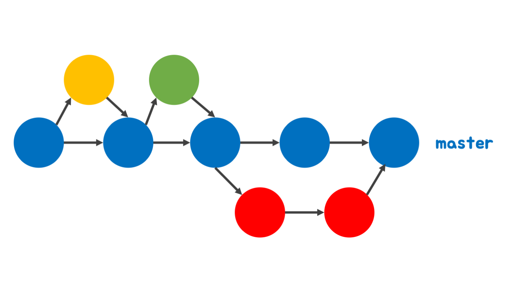
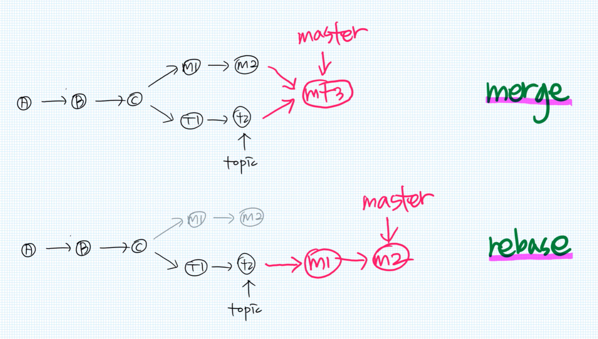

# Git
- Git branch 전략
  + Github-Flow
  + Git-Flow
- [Git vs SVN]
- merge vs rebase
- Git cheatsheet

## Git branch 전략
- **여러 개발자가 하나의 저장소를 사용하는 환경에서 저장소를 효과적으로 활용**하기 위한 work-flow
- 협업을 유연하게 하는 방법론
- 이를 사용하지 않으면 개발할 branch 및 핫픽스 시 어떤 branch를 기준으로 수정해야할지 감이 안 잡힘

### Github-Flow

- **1개의 master 브랜치와 PR을 활용**한 단순하고 민첩한 브랜치 전략
- 프로세스
  1. 브랜치 생성, 이름을 통해 의도를 명확히 드러내야 함
  2. 개발 및 커밋, 커밋 메세지를 최대한 상세하게 적기
  3. Pull Request 생성
  4. 리뷰/토의 진행
  5. 해당 내용을 라이브 서버에 배포
  6. Merge
- 특징
  * 브랜치 전략이 간단
  * CI(빌드 및 테스트의 자동화) / CD(배포의 자동화)가 master 브랜치에 의존하기 때문에 자연스럽게 이어짐

### Git-Flow

- 5개의 브랜치를 이용해 저장소를 운영하는 전략
- 브랜치 종류
  + master: 메인, 라이브 서버에서 제품으로 출시되는 브랜치
  + develop: 메인, 다음 출시 버전을 대비해 개발하는 브랜치
  + feature: 기능 개발 브랜치, develop 브랜치에 포함
  + release: 다음 버전 출시를 준비, develop 브랜치를 release 브랜치로 옮긴 후 QA 테스트 진행
  + hotfix: master 브랜치에서 발생한 버그 수정
- 프로세스
  1. 신규 기능 배포
    * develop 브랜치에서 신규로 개발 기능을 위한 feature 브랜치 생성
    * 기능을 완성하면 develop 브랜치에 merge
  2. 라이브 서버로 배포
    * feature 브랜치가 develop 브랜치에 merge될 시 QA 테스트를 위해 release 브랜치 생성
    * 오류 발생 시 release에서 고침
    * 통과했다면 release 브랜치를 master 브랜치에 merge, 오류를 수정했다면 develop 브랜치에도 merge  
  3. 배포 후 관리
    * 배포된 라이브 서버에서 버그 발생 시 hotfix 브랜치 생성 및 버그 픽스
    * 종료된 hotfix 브랜치를 master와 develop 양쪽에 merge해서 동기화
- 특징
  + 주기적으로 배포하는 서비스에 적합
  + 수많은 IDE에서 시각화 도구 지원

- 출처: https://hyeon9mak.github.io/git-branch-strategy/

## Git vs SVN
- Git: 분산 관리, local에서도 관리 가능
- SVN: 중앙 집중 관리, commit 시 모든 공유 폴더에 적용

## merge vs rebase

- merge: 브랜치 병합
- rebase: 대상 branch를 베이스로 커밋 재정렬, fast-forward 병합이 가능함

## Git Cheatsheet
- https://github.com/Factoriall/git-cheatsheet/blob/master/README.md
