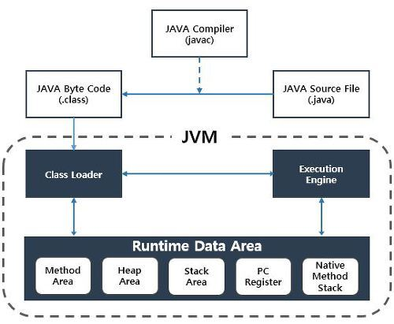
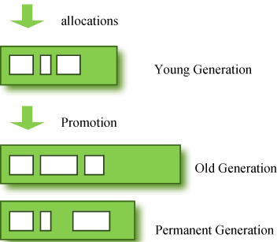

# JAVA/Kotlin

- [객체지향 VS 절차지향](#객체지향-vs-절차지향)
- [JVM & GC](#JVM-&-GC)
- [SOLID](#SOLID)
- [Overriding vs Overloading](#Overriding-vs-Overloading)
- [Interface vs Abstract class](#Interface-vs-Abstract-class)
- [바인딩](#바인딩)
- [Kotlin](#Kotlin)
  + Kotlin이 Java와 다른 점
  + 확장 함수
  + Sealed Class
- [그 외](#그-외)

## 객체지향 VS 절차지향

### 절차 지향
- **순차적인 처리**가 중요시되는 프로그래밍 ex) C언어
- 장점
  * 하드웨어 작업 처리 방식과 유사하기 때문에 시간적으로 유리
- 단점
  * 유지보수가 어려움
  * 실행 순서가 정해져 있어 순서가 바뀔 시 동일 결과를 보장하기 어려움
  * 디버깅의 어려움

### 객체 지향
- **실제 세계를 모델링**하여 소프트웨어를 개발하는 방식
- 객체 지향 3대 특성
1. 캡슐화
  + 관련 변수 및 메서드가 **하나의 묶음으로 정리**하는 작업
  + 외부의 잘못된 접근을 막기 위해 **접근 제어자**를 사용해 변수 및 함수를 감추는 **은닉성**을 지님
2. 상속
  + **부모 클래스로부터 부모의 모든 자원을 자식 클래스에 물려 받는 것**
  + 하나의 부모 클래스가 여러 자식을 가질 수 있지만 하나의 자식 클래스가 여러 부모 클래스를 상속 받을 순 없음
  + 비효율적인 코드 중복을 피하고 유지보수가 편해지는 장점
3. 다형성
  + 하나의 객체가 여러 가지 타입을 가질 수 있는 것
  + 부모 클래스 타입의 참조 변수로 자손 클래스의 인스턴스를 참조
~~~java
class Parent { ... }
class Child extends Parent { ... }
...
Parent pa = new Parent(); // 허용
Child ch = new Child();   // 허용
Parent pc = new Child();  // 허용
Child cp = new Parent();  // 오류 발생.
pa = ch;//
ch = (Child)pa; //부모는 타입변환 생략 가능
~~~
- 자바를 사용하는 이유: 종속성이 없음. C/C++은 속도가 빠르나 윈도우 등의 OS에 종속적인데 자바는 JVM으로 따로 관리하기 때문에 종속성이 없음.

## JVM & GC
### JVM
- JAVA Virtual Machine의 약자
- 자바 애플리케이션을 클래스 로더를 통해 읽어들여 자바 API와 함께 실행하는 역할
- JAVA와 OS 사이에 중개자 역할, OS에 구애받지 않고 JAVA 재사용
- 스택 기반의 가상머신
- Garbage Collection(GC)이라는 메모리 관리 수행

### 자바 프로그램 실행 과정



1. 프로그램 실행 시 JVM은 OS로부터 프로그램이 필요로 하는 메모리 할당 받음
2. 자바 컴파일러(javac)가 자바 소스코드(.java)를 읽어들여 자바 바이트코드(.class)로 변환
3. 바이트코드를 Class Loader를 통해 JVM으로 로딩
4. 로딩된 바이트코드들은 Execution Engine을 통해 해석 및 BinaryCode로 변경
5. 해석된 바이트 코드는 Runtime Data Areas에 배치되어 실질적 수행

### RunTime Data Areas
- JVM이 프로세스로서 수행되기 위해 OS에 따라 할당받는 메모리 영역
- 종류
1. Method Area: 모든 Thread 공유, 클래스, 변수, 메서드, static, 상수 정보 저장
2. Heap Area: 모든 Thread 공유, 동적 객체 저장 및 부족할시 GC 실행
3. Stack Area: 각 스레드마다 하나씩 생성, 지역 변수 및 매개변수들이 저장
4. PC Register: 각 스레드마다 하나씩 생성, 현재 수행 중인 JVM 명령어 주소값 저장  
5. Native Method Stack: 각 스레드마다 하나씩 생성, 다른 언어의 메서드 호출을 위해 할당되는 구역, 언어에 맞게 스택 형성

### Garbage Collection



- 불필요한 메모리를 알아서 정리해주는 용도
- C언어의 free()를 Java/Kotlin에서 필요없게 해준다

#### Minor GC
- 일회성 구역
- Young Generation: 새롭게 생성된 객체가 할당되는 영역
- 동작방식
  1. Eden 영역(새로 생성 객체가 할당되는 구역)이 꽉 찰 시 사용되지 않은 영역 삭제 및 남은 것 Survivor 영역으로 이동
  2. Survivor 영역이 찰 시 이 중 살아남은 영역을 다른 영역으로 옮기고 나머지 삭제
  3. 계속 살아남은 객체는 Old 영역으로 이동(Promotion)
- 실행속도가 빠름

### Major GC
- Old Generation: Young 영역에서 Reachable 상태를 유지해 살아남은 객체가 복사되는 영역
- 동작 방식
  + Promotion이 지속적으로 발생해 Old 영역의 메모리가 부족할 시 발생
  + Old 영역 메모리 정리
- 실행속도가 느림

## SOLID
1.	SRP(Single Responsibiility Principle): 단일 책임 원칙
  - 클래스 및 메소드는는 단 하나의 목적으로 한다.
2.	OCP(Open Closed Principle): 개방 폐쇠 원칙
  - 확장에는 개방, 변화에 대해서는 폐쇄
3.	LSP(Liskov Substitution Principle): 리소코프 치환 법칙
  - 서브 타입을 언제나 자신의 기반 타입으로 교체 가능해야 한다.
4.	ISP(Interface Segregation Principle): 인터페이스 분리 원칙
  - 클라이언트는 자신이 사용하지 않는 메소드에 의존 관계를 맺으면 안된다.
  - 인터페이스로 분리해서 만든다.
5.	DIP(Dependency Inversion Principle): 의존 역전 원칙
 - 고차원 묘듈은 저차원 모듈에 의존적이면 안된다.

- 관련 예제 설명: https://bottom-to-top.tistory.com/27

## Overriding vs Overloading
### Overriding
- 상위 클래스 혹은 인터페이스에 존재하는 메소드를 하위 클래스에서 필요에 맞게 **재정의**하는 것을 의미. 자바의 경우 오버라이딩 시 동적 바인딩된다.

``` kotlin
class Animal{
  fun walk(){
    println("네발로 걷기")
  }
}

class Person: Animal(){
  override fun walk{
    println("두발로 걷기") // 오버라이딩 통해 부모 클래스의 메소드 재정의
  }
}
```
### Overloading
- **같은 이름** 의 메서드를 매개변수의 타입과 개수에 따라 **다르게** 만들 수 있게 하는 것. 정적 바인딩으로 처리 가능.

``` kotlin
fun function(val a: Int)
fun function(val b: String)
fun function(val c: Int, val d : Float)

```

## Interface vs Abstract class

### 추상 클래스
- **미완성 설계도**
- 선언부만 작성하고 구현부는 작성하지 않을 채 남겨 둔 것
- abstract 키워드
- 클래스는 abstract로 지정 시 new를 통해 직접 생성 불가능
- 메서드에 구현 시 구현 부분은 없음, 자식 클래스에서 반드시 구현해야 함
- 일반 메서드 및 멤버 변수를 구성원으로 가질 수 있음
- 하나의 추상 클래스만 상속 가능
- 코드
~~~java
public abstract class Player {
    //멤버 변수 생성 가능
    boolean pause;
    int currentPos;

    public Player() {
        this.pause = false;
        this.currentPos = 0;
    }
    // abstract 통해 생성, 이는 무조건 상속 받는 클래스에서 구현해야 한다
    abstract void play(int pos);
    abstract void stop();

    //일반 메서드 구현 가능
    void pause() {
        if (pause) {
            pause = false;
            play(currentPos);
        } else {
            pause = true;
            stop();
        }
    }
}
~~~

### 인터페이스
- **기본 설계도**
- 그 자체로 사용되기 보다, 다른 클래스를 작성하는데 도움을 줄 목적으로 작성
- 모든 멤버 변수는 public static final이어야 함
- 일반 메서드 및 멤버 변수를 가질 수 없음
- 여러 인터페이스 상속 가능
- 코드
~~~java
public interface Movable {
    void move(int x, int y);//메서드에 public abstract 생략
}
interface Attackable {
    void attack(Unit u);
}
interface Fightable extends Movable, Attackable {//다중 상속 가능
}
~~~

## 바인딩
+ 함수 바인딩: 함수를 만들어 컴파일 시 코드가 메모리에 저장, 함수 호출 부분에서 해당 함수의 코드가 저장된 메모리 주소값이 저장

### 종류
+ 정적 바인딩: 메모리 주소값을 저장하는 작업이 **컴파일** 때 결정, 이후로 변하지 않음
+ 동적 바인딩: 메모리 주소 값을 저장 작업이 컴파일 때 보류되고 **런타임** 때 결정

## Kotlin이 Java와 다른 점
- 특징
1. 정적 타입 언어
  - 컴파일 시 변수의 자료형이 결정
2. Java와 100% 호환
3. Null Safety
  - NPE 방지
  - ? 및 !!를 활용해서 Nullable 및 Non-null 판별
4. Immutable
  - val: Immutable, 할당 후 변경 불가
  - var: Mutable, 언제든 변경 가능
5. 코드의 간결성
  - getter(), setter() 등의 보일러 플레이트 코드 최소화
6. 함수형 프로그래밍
  - 람다식으로 선언되지 않고도 익명 함수기능에 식 전달 가능
  - 함수가 일급 객체로 사용

~~~kotlin
fun add(a: Int, b: Int) = a + b
fun subtract(a: Int, b: Int) = a - b
fun main() {
    val functions = mutableListOf(::add, ::subtract)
    //함수를 객체처럼 사용해 mutableList의 class로 지정

    println(functions[0])
    // fun add(kotlin.Int, kotlin.Int): kotlin.Int

    println(functions[0](12, 30))
    // 12+30 = 42

    println(functions[1](57, 12))
    // 57-15 = 42
}
~~~

~~~kotlin
    fun calculator(a: Int, b: Int, sum: (Int, Int) -> Int): Int {
        return a + b + sum(a, b)
    }
    fun main() {
        val out = calculator(11, 10, { a, b -> a + b })
        // calculator(11, 10) { a, b -> a + b } 와 동일
        // 11+10+(11+10) = 42
    }
~~~

- 출처: https://velog.io/@beargu2/Kotlin-%ED%8A%B9%EC%A7%95

### Sealed Class
- **부모 클래스를 상속받는 자식 클래스의 종류를 제한**
- enum class의 확장 클래스, enum은 하위 객체를 1개밖에 생성을 못하지만 sealed class는 1개 이상의 객체 생성 가능
- 특징
  + open 변경자가 기본
  + 기본적으로 추상 클래스
  + private 생성자만 가짐  
  + 같은 파일 안에서만 상속 가능
  + Sealed 클래스의 서브 클래스를 상속한 클래스들은 아무대나 존재해도 상관 없음
  + When 사용할 시 else를 사용할 필요가 없음, 대신 sealed class 내의 모든 클래스에 대한 조건을 구현해야 한다.

~~~kotlin
sealed class Color {
    object Red: Color()
    object Green: Color()
}
val color : Color = Color.Red
val font = when (color) {
    is Color.Red -> {
        "Noto Sans"
    }
    is Color.Green -> {
        "Open Sans"
    }
    // No error!
}
~~~

### 확장 함수

- 외부 라이브러리가 제공하는 자체 클래스를 확장시켜 개발자가 원하는 대로 만든 함수
- static 메소드
- **정적 바인딩**
- override 불가능, 만약 receiver type 내에 똑같은 이름의 함수가 있다면 확장 함수는 무시된다.
~~~kotlin
fun main() {
    val testList = mutableListOf<Int>(1, 2, 3)

    // swap() 함수 호출
    testList.swap(0, 2)
    print(testList)
}
/* MutableList 안의 두 원소 위치를 바꿔주는 함수  
MutableList<Int>는 receiver type으로, 확장 함수를 추가할 클래스*/
fun MutableList<Int>.swap(index1: Int, index2: Int) {
    val tmp = this[index1]//this를 이용해 receiver type이 가지는 public instance에 접근 가능, 이렇게 접근한 객체는 receiver object
    this[index1] = this[index2]
    this[index2] = tmp
}
~~~

- 출처: https://choheeis.github.io/newblog//articles/2020-12/kotlin-extension-function

### 그 외
- open 키워드: 상속 받을 때 부모 클래스를 명시하기 위해 사용. Kotlin은 자바와 다르게 final 키워드가 기본으로 달려있기 때문에 이를 붙여줘야 한다.
- Git: 분산 관리, local에서도 관리 가능
- SVN: 중앙 집중 관리, commit 시 모든 공유 폴더에 적용
