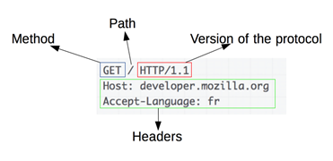
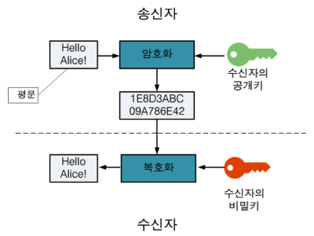
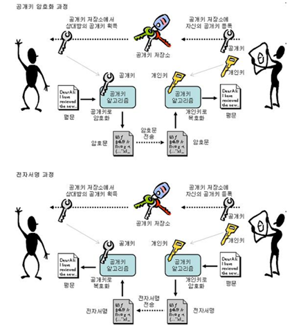
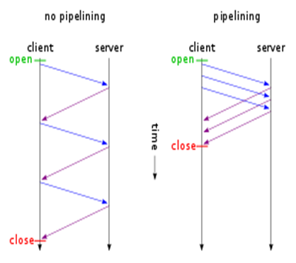
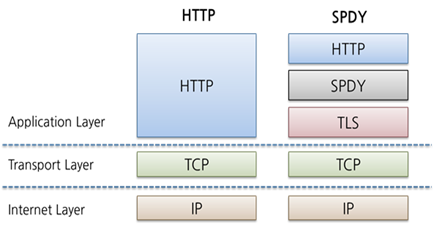
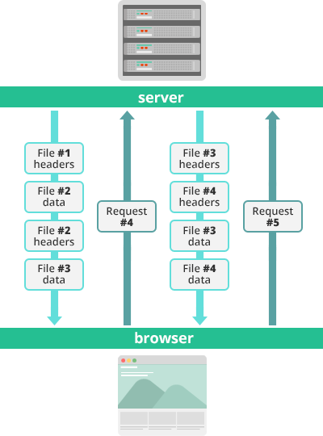
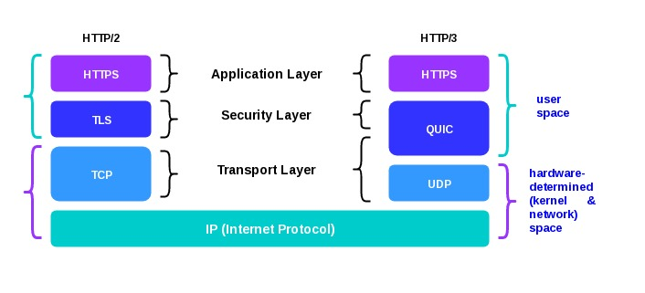

# Network

- HTTP 관련
  * [HTTP vs HTTPS](#HTTP-vs-HTTPS)
  * [HTTP 1.1 vs 2.0 vs 3.0](#HTTP-1-vs-2-vs-3)
  * RESTful
  * HTTP 응답코드
- 웹브라우저에 google.com을 쳤을 때 일어나는 일
- TCP vs UDP

## HTTP vs HTTPS
### HTTP

#### 특징
* Application 층의 프로토콜, 서버 및 클라이언트 간의 정보를 주고받기 위한 프로토콜
* 상태를 가지지 않으며(Stateless), Method, Path, Version, Header, Body로 구성된 평문의 Message 형태

#### 문제점
* 평문 통신이기 때문에 경로 상에 **도청**이 가능하다
* 통신 상대를 확인하지 않기 때문에 **위장**이 가능하다
* 수신한 것과 받은 것이 완전히 일치함을 증명할 수 없기 때문에 **변조**가 가능하다

### HTTPS
#### 특징
* HTTP에 데이터 암호화가 추가된 것으로, SSL(Secure Sockets Layer) 또는 TLS(Transport Layer Security)를 추가
* 공개키/개인키 암호화 방식을 이용해 데이터를 암호화

#### 공개키/개인키 암호화

- 모두에게 공개되는 **공개키**, 자신만 가지고 있는 **개인키**로 암호화되는 방식
- 공개키로 암호화 시 개인키로만 복호화 가능 -> **안정성 확보**
- 개인키로 암호화 시 공개키로만 복호화 가능 -> **인증 정보 확인 및 신뢰성 확보**

#### HTTPS 동작 과정

1. A기업은 HTTP 기반의 애플리케이션에 HTTPS를 적용하기 위해 공개키/개인키를 발급
2. CA 기업에게 돈을 지불하고, 공개키를 저장하는 인증서의 발급을 요청
3. CA 기업은 CA기업의 이름, 서버의 공개키, 서버의 정보 등을 기반으로 인증서를 생성하고 CA 기업의 개인키로 암호화하여 A기업에게 이를 제공함
4. A기업은 클라이언트에게 암호화된 인증서를 제공
5. 브라우저는 CA기업의 공개키를 미리 다운받아 갖고 있어, 암호화된 인증서를 복호화
6. 암호화된 인증서를 복호화하여 얻은 A기업의 공개키로 데이터를 암호화하여 요청을 전송

---
## HTTP 1 vs 2 vs 3
### HTTP 1.1
#### 특징
- Keep-Alive: 한 번 맺었던 연결을 끊지 않고 지속적으로 유지하기 위해 넣는 헤더 정보
- Pipelining: 한 번의 커넥션에 한 방에 여러 순차적인 요청을 연속적으로 보내고 순서에 맞춰서 응답받는 방식

#### 문제점
- HOL(Head Of Line) Blocking: 먼저 들어온 데이터들도 앞에 오지 않은 데이터로 인해 대기하는 현상 -> pipelining의 가장 큰 문제점
- RTT(Round Trip Time)의 증가: 매 요청 때마다 커넥션 생성, Keep-Alive의 시간을 넘으면 끊기고 이 때마다 3-way handshaking으로 인한 불필요한 RTT의 증가
- 무거운 헤더 구조: 많은 메타 정보 저장(20bytes), 반복적인 헤더 전송으로 인한 오버헤드 증가

### HTTP 2

#### 특징
- SPDY 프로토콜 기반
- Multiplexted Streams(Multiplexing): 커넥션 하나로 동시에 여러 개의 메세지를 주고받고 응답은 순서에 상관없이 Stream으로 주고 받는 것

- Stream Prioritization: 받는 자원들의 의존관계를 설정하여 먼저 받을 자원 지정 가능
- Server Push: 클라이언트 요청에 대해 요청하지 않은 부가 리소스도 같이 보내줌

- Header Compression: Hpack 압축방식을 이용해 중복 헤더 제거

#### 문제점
- 여전히 TCP에 대한 HOL Blocking(패킷 loss 발생 시 일어나는 대기 현상)은 해결 안됨

### HTTP 3

- 기존 TCP의 문제점인 HOLB 문제 해결을 위해 TCP 대신 UDP(QUIC) 사용
- 3-way handshaking 필요 없음 -> 1 RTT 연결설정
- 패킷 손실 감지에 걸리는 시간 단축
- HTTP 2와 같은 Multiplexing 사용
- 기존 IP 주소 대신 랜덤 값인 Connection ID 사용 - 기존 연결을 유지하기 쉬움(Wifi -> LTE 전환 등등...)
