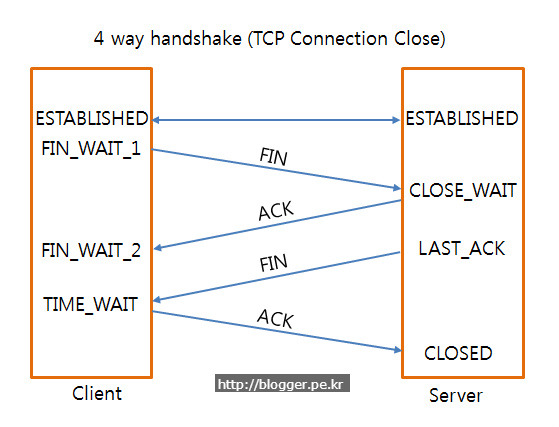

# Network
- [OSI 7계층](#OSI-7계층)
- HTTP 관련
  * [HTTP vs HTTPS](#HTTP-vs-HTTPS)
  * [HTTP 1.1 vs 2.0 vs 3.0](#HTTP-1-vs-2-vs-3)
  * [REST](#REST)
  * [HTTP 응답코드](#HTTP-응답코드)
- [웹브라우저에 구글을 쳤을 때 일어나는 일](#웹브라우저에-구글을-쳤을-때-일어나는-일)
  * 웹 캐시
- [TCP vs UDP](#TCP-vs-UDP)

## OSI 7계층

- 국제표준화기구(ISO)에서 개발한 모델로, 컴퓨터 네트워크 프로토콜 디자인과 통신을 계층으로 나누어 설명한 것
- 목적: 프로토콜을 기능별로 나눠 각 계층은 하위 계층의 기능만을 이용하고 상위 계층에게 기능을 제공.

### 물리 계층
- Physical Layer
- 주로 전기적, 기계적, 기능적인 특성을 이용해 데이터 전송
- 장비: 케이블/리피터/허브
- 단위: 비트
- 프로토콜
  + RS-232: 15m 이하 단거리 전송을 위한 직렬 인터페이스

### 데이터링크 계층
- Data-Link Layer
- 물리적인 연결을 통해 **인접한 두 장치 간**의 신뢰성 있는 정보 전송 담당
- 오류 확인 및 재전송 기능 존재
- MAC(물리) 주소를 통해 통신
- 장비: 브릿지, 스위치
- 단위: 프레임
- 프로토콜
  + Ethernet: 네트워크에 연결된 각 기기들이 가지는 MAC 주소를 이용해 이용해 상호간 데이터를 주고 받기 위해 만들어진 프로토콜

### 네트워크 계층
- 중계 노드를 통해 전송하는 경우 어떻게 중계할 것인가를 규정
- 라우팅 기능: 목적지까지 가장 안전하고 빠르게 데이터를 보내는 기능을 가짐
- 데이터 전송할 IP 주소를 가지고 있음
- 단위: 패킷
- 프로토콜
  1. IP
  + 패킷 교환 네트워크에서 정보를 주고 받는데 사용하는 정보 위주 규약
  + 호스트의 주소 지정, 패킷 분할 및 조립 담당
  + 비연결형, 비신뢰성 -> TCP에서 이를 해결해 줌
  2. ICMP
  + IP 패킷을 처리할 때 발생되는 문제를 알림
  + Ping 명령어를 통해 작동 여부 및 응답시간 측정
  3. ARP
  + IP 주소를 기기 고유 주소인 MAC 주소로 대응
  + MAC 주소와 함께 데이터링크 계층으로 보내는 역할

### 전송 계층
- Transport Layer
- 종단 간 신뢰성 있고 정확한 데이터 전송 담당
- 단위: TCP는 세그먼트, UDP는 데이터그램
- 프로토콜
  + TCP
  + UDP
- 자세한 내용은 아래 [TCP vs UDP](#TCP-vs-UDP) 참고

### 세션 계층
- Session Layer
- 통신 장치 간 상호작용 및 동기화 제공
- 연결 손실 발생시 복구 시도
- 프로토콜
  1. NetBIOS
  - 네트워크의 기본적인 입출력을 정의, 로컬 네트워크에 통신 서비스 제공
  2. RPC(Remote Procedure Call)
  - Windows 운영체제에서 사용하는 원격프로시저 호출 프로토콜
  3. WinSock(Windows Socket)
  - 유닉스 등에서 사용하는 Socket을 Windows에서 구현한 것

### 표현 계층
- Presentation Layer
- 데이터를 어떻게 표현할지 정하는 역할을 하는 계층
- 기능
  1. 데이터 암호화, 복호화
  2. 데이터 인코딩을 통한 압축(부호화)
- 프로토콜
  1. SSL(Secure Socket Layer)
  + 네트워크 레이어 암호화 방식
  2. ASCII
  - 문자를 사용하는 장치에 사용, 문자 인코딩
  3. JPEG, MPEG
  - 이미지, 멀티미디어를 압축할 때 사용

### 응용 계층
- Application Layer
- 사용자와 가장 밀접한 계층으로 인터페이스 역할
- 응용 프로세스 간의 정보 교환 담당
- 프로토콜
  1. HTTP(HyperText Transfer Protocol)
  - WWW 상에 정보를 주고 받을 수 있는 프로토콜
  - 주로 HTML 문서를 주고 받는데 사용
  - 80번 포트
  2. SMTP(Simple Mail Transfer Protocol)
  - 인터넷에서 이메일을 보내고 받기 위해 이용되는 프로토콜
  - 25번 포트
  3. FTP(File Transfer Protocol)
  - 컴퓨터 간 파일 전송에 사용되는 프로토콜
  - 데이터 전달: 20번 포트, 제어 정보 전달: 21번 포트
  4. TELNET
  - 인터넷이나 로컬 영역 네트워크 연결에 사용
  - 보안 문제로 사용 감소, 원격제어를 위해 SSH로 대체 중.

## HTTP vs HTTPS
### HTTP

#### 특징
* Application 층의 프로토콜, 서버 및 클라이언트 간의 정보를 주고받기 위한 프로토콜
* 상태를 가지지 않으며(Stateless), Method, Path, Version, Header, Body로 구성된 평문의 Message 형태

#### 문제점
* 평문 통신이기 때문에 경로 상에 **도청**이 가능하다
* 통신 상대를 확인하지 않기 때문에 **위장**이 가능하다
* 수신한 것과 받은 것이 완전히 일치함을 증명할 수 없기 때문에 **변조**가 가능하다

### HTTPS
#### 특징
* HTTP에 데이터 암호화가 추가된 것으로, SSL(Secure Sockets Layer) 또는 TLS(Transport Layer Security)를 추가
* 공개키/개인키 암호화 방식을 이용해 데이터를 암호화

#### 공개키/개인키 암호화

- 모두에게 공개되는 **공개키**, 자신만 가지고 있는 **개인키**로 암호화되는 방식
- 공개키로 암호화 시 개인키로만 복호화 가능 -> **안정성 확보**
- 개인키로 암호화 시 공개키로만 복호화 가능 -> **인증 정보 확인 및 신뢰성 확보**

#### HTTPS 동작 과정

1. A기업은 HTTP 기반의 애플리케이션에 HTTPS를 적용하기 위해 공개키/개인키를 발급
2. CA 기업에게 돈을 지불하고, 공개키를 저장하는 인증서의 발급을 요청
3. CA 기업은 CA기업의 이름, 서버의 공개키, 서버의 정보 등을 기반으로 인증서를 생성하고 CA 기업의 개인키로 암호화하여 A기업에게 이를 제공함
4. A기업은 클라이언트에게 암호화된 인증서를 제공
5. 브라우저는 CA기업의 공개키를 미리 다운받아 갖고 있어, 암호화된 인증서를 복호화
6. 암호화된 인증서를 복호화하여 얻은 A기업의 공개키로 데이터를 암호화하여 요청을 전송

---
## HTTP 1 vs 2 vs 3
### HTTP 1.1
#### 특징
- Keep-Alive: 한 번 맺었던 연결을 끊지 않고 지속적으로 유지하기 위해 넣는 헤더 정보
- Pipelining: 한 번의 커넥션에 한 방에 여러 순차적인 요청을 연속적으로 보내고 순서에 맞춰서 응답받는 방식

#### 문제점
- HOL(Head Of Line) Blocking: 먼저 들어온 데이터들도 앞에 오지 않은 데이터로 인해 대기하는 현상 -> pipelining의 가장 큰 문제점
- RTT(Round Trip Time)의 증가: 매 요청 때마다 커넥션 생성, Keep-Alive의 시간을 넘으면 끊기고 이 때마다 3-way handshaking으로 인한 불필요한 RTT의 증가
- 무거운 헤더 구조: 많은 메타 정보 저장(20bytes), 반복적인 헤더 전송으로 인한 오버헤드 증가

### HTTP 2

#### 특징
- SPDY 프로토콜 기반
- Multiplexted Streams(Multiplexing): 커넥션 하나로 동시에 여러 개의 메세지를 주고받고 응답은 순서에 상관없이 Stream으로 주고 받는 것

- Stream Prioritization: 받는 자원들의 의존관계를 설정하여 먼저 받을 자원 지정 가능
- Server Push: 클라이언트 요청에 대해 요청하지 않은 부가 리소스도 같이 보내줌

- Header Compression: Hpack 압축방식을 이용해 중복 헤더 제거

#### 문제점
- 여전히 TCP에 대한 HOL Blocking(패킷 loss 발생 시 일어나는 대기 현상)은 해결 안됨

### HTTP 3

- 기존 TCP의 문제점인 HOLB 문제 해결을 위해 TCP 대신 UDP(QUIC) 사용
- 3-way handshaking 필요 없음 -> 1 RTT 연결설정
- 패킷 손실 감지에 걸리는 시간 단축
- HTTP 2와 같은 Multiplexing 사용
- 기존 IP 주소 대신 랜덤 값인 Connection ID 사용 - 기존 연결을 유지하기 쉬움(Wifi -> LTE 전환 등등...)
---
## REST
- 정의: REpresentational State Transfer)의 약자, World Wide Web 같은 분산 하이퍼미디어 시스템을 위한 SW 아키텍쳐의 한 형식
- DB에 저장되어 있는 값을 json 등의 형태로 **리소스 값을 표현한 상태**

### 특징
1. Uniform: 특정한 인터페이스 사용
2. Stateless: 상태를 따로 저장 및 관리하지 않음
3. Cacheable: HTTP가 가지는 캐싱을 활용 가능
4. Self-Descriptiveness: REST API 메세지만 보고도 쉽게 이해가 가능한 자체 표현 구조로 표현
5. Client-Server: 서버에서 API 제공, 클라이언트는 사용자 인증 및 컨텍스트를 직접 관리하눈 구조
6. Hierachical Structure: 다층 계층으로 구성 가능, 보안 및 암호화 계층 추가 및 네트워크 기반의 중간 매체를 활용 가능

#### REST API

- 구성 요소
1. URI - 어떤 리소스가 있는지 표현
2. HTTP Method - 행위
- 특징
1. 리소스와 행위를 명시적으로 직관적으로 분리
- URI는 정보의 자원을 표시, 동사 대신 명사로 표시
- 자원에 대한 행위는 HTTP Method로 표현
  + GET: URI가 가진 정보를 검색하고 응답
  + POST: 요청된 자원 생성, 새로 작성된 리소스의 경우 HTTP 헤더 항목에 Location: URI 포함
  + PUT: 요청된 자원을 수정
  + DELETE: 요청된 자원을 삭제 요청
2. 메세지의 경우 Header와 Body를 명확히 분리
- 보낼 Entity 정보는 Body, API 버전 정보 및 응답받고자하는 MIME 타입 등은 Header에 담기
3. API 버전 관리
- 환경에 따라 API 버전 관리, 변경 시 하위호환성을 보장해야 됨
4. 서버와 클라이언트가 같은 방식을 사용해서 요청
- 서버/클라이언트가 둘다 json으로 보내던가 text로 보내던가 하는 식으로, URI가 플랫폼 중립적으로 작동
---
## HTTP 응답코드
- 1XX: Information responses, 서버가 요청을 받았고 클라이언트는 작업을 계속 진행하라는 의미
  + 100 Continue: 진행중
  + 101 Switching Protocol: 업그레이드 요청 헤더에 대한 응답
  + 102 Processing: 요청을 수신하고 처리 중이나 제대로 된 응답을 줄 수 없음
- 2XX: Sucessful responses: 요청 성공
  + 200 OK: 요청을 성공적으로 수행
  + 201 Created: 요청 성공 및 새로운 리소스 생성
- 3XX: Redirection messages
  + 301 Moved Permanently: 요청한 리소스의 URI가 변경됨
- 4XX: Client error responses
  + 400 Bad Request: 잘못된 문법으로 인해 서버가 요청을 이해할 수 없음
  + 401 Unauthorized: 인증된 클라이언트가 아니라서 답할 수 없음, 인증을 해야됨
  + 403 Forbidden: 컨텐츠에 접근할 권리가 없음, 401가 다르게 서버가 클라이언트가 누군지 알고 있음
  + 404 Not Found: 요청받은 리소스(URI)를 받을 수 없음
  + 405 Not Acceptable: 요청 메소드를 서버에서 알고 있지만 제거되어 사용할 수 없음
- 5XX: Server error responses
  + 500 Internal Server Error: 웹사이트 서버에 문제가 발생했음
---
## 웹브라우저에 구글을 쳤을 때 일어나는 일

### 1. 웹브라우저에서 일어나는 일

- 1-1) URL 입력 시 도메인 네임을 DNS 서버에서 검색
- 1-2) 검색해서 나온 IP 주소를 찾아서 URL 정보와 같이 전달
- 1-3) HTTP 프로토콜에 따라 HTTP 요청 메세지 생성, 이 때 REST 사용
### 2. 프로토콜 스택에서 일어나는 과정

- 프로토콜 스택(TCP/IP 4-5계층): 운영체제에 내장된 네트워크 제어용 소프트웨어
- 2-1) 전송(Transport) 계층에서 TCP 프로토콜 따라서 신뢰성 있게 전송을 보장 및 헤더 붙인 세그먼트 형태로 네트워크 계층에 전달
- 2-2) 인터넷(Internet) 계층에서 IP 프로토콜 따라 목적지로 데이터를 전송하기 위해 거치는 경로 결정, 이러한 정보가 담긴 헤더를 붙여 패킷(IP 다이어그램) 형태로 전달
- 2-3) ARP 프로토콜에 따라 기기 고유의 주소인 MAC 주소를 대응, 데이터 링크(Data Link) 계층으로 보내 물리 주소 및 제어 정보를 프레임에 추가
- 2-4) 물리(Physical) 계층에서 랜선, 허브를 경유해서 전기 신호로 변환시켜 신호 송출
### 3. 인터넷에서 일어나는 일
- 3-1) IP 프로토콜 따라 얻은 라우팅 경로 따라 목적지로 이동
- 3-2) 방화벽 서버 도착 시 방화벽이 패킷이 정상적인지 확인
- 3-3) 엑세스 페이지의 데이터가 프록시 캐시에 존재할 시 웹서버로 보낼 필요 없이 바로 캐시 서버에서 값을 꺼냄
### 4. 웹서버에서 일어나는 일
- 4-1) 웹서버에 도착 시 웹 서버 쪽의 프로토콜 스택이 패킷 추출 및 메세지 복원
- 4-2) 요청에 따른 데이터를 응답 메세지에 넣어 클라이언트로 회송
- 4-3) 왔던 방식 그대로 응답 메세지가 클라이언트로 전달

### 웹 캐시
- 사용자가 웹 사이트에 접속 시 정적 컨텐츠를 특정 위치에 저장하여 웹 사이트 서버에 매번 요청이 아닌 특정 위치에 부르는 것

#### 종류
1. Browser Cache
- 브라우저 또는 HTTP 요청을 하는 Client Application에 의해 내부 디스크에 캐시
- 개인 한정 캐시
- 브라우저 Back 버튼 또는 이미 방문한 페이지 재방문하는 경우 극대화

2. Proxy Caches
- Client나 Server가 아닌 **네트워크** 상에서 동작
- 큰 회사/IPS의 방화벽에 설치
- 대기시간 및 트래픽 감소, 접근정책 및 제한 우회, 사용률 기록 등을 수행
- 한정된 수의 클라이언트를 위해 무한대의 웹서버 컨텐츠 캐시

3. Gateway Cache
- 서버 앞 단에 설치
- 요청에 대한 캐시 및 효율적인 분배를 통한 가용성, 신뢰성, 성능 등을 향상

---
## TCP vs UDP
### 공통점
- 전송 계층에서 사용하는 대표적인 프로토콜
- IP 프로토콜 기반으로 구현

### TCP

- 연결지향형 프로토콜
  + 가상 회선 패킷 교환 방식 사용
  + 순서 보장
  + 신뢰성 있는 데이터 전송
  + 연결 보장을 위해 **handshaking** 사용
- 혼잡 제어 & 흐름 제어 & 오류 제어
- 속도가 느린 편
- 전이중(양방향 동시), 점대점(2개의 종단점) -> 브로드캐스팅 및 멀티캐스팅 지원을 하지 않음
- HTTP, Email, File 전송 시 사용

#### Handshaking
- 3-way handshaking 및 4-way handshaking으로 구분

  + 3-Way Handshaking

  + 초기 연결을 설정 시 사용
  + 순서
  1. 클라이언트가 서버 접속 요청하는 SYN(a) 패킷을 보냄
  2. 서버가 SYN(a) 수신, 요청을 수락한다는 ACK(a+1) 및 SYN(b) 패킷을 보냄
  3. 클라이언트에서 수신 및 ACK(b+1) 패킷을 서버로 보냄
  4. 서버가 수신한 후에 연결 설정

  + 4-Way Handshaking

  - 연결을 해제할 시 사용
  - 순서
  1. 클라이언트에서 연결 종료하겠다는 FIN 메세지를 보냄
  2. 서버는 응답 ACK를 보내고 동시에 해당 포트에 연결되어 있는 애플리케이션에게 close() 요청
  3. ACK 받은 클라이언트는 대기 상태 돌입
  4. close() 요청 받은 서버 애플리케이션은 종료 프로세스 진행 후 FIN을 클라이언트로 보냄
  5. 이를 받은 클라이어트는 ACK를 서버에 전송하고 일정 시간 대기 후 close, ACK 받은 서버도 포트를 닫음

#### 흐름 제어
- 송신 측의 데이터 처리 속도 조절을 통해 수신자의 버퍼 오버플로우 및 패킷 손실 방지
1. Stop and Wait: 매번 전송 패킷에 대한 확인 응답을 받아야 다음 패킷 전송
2. Sliding Window: 윈도우 포함 모든 패킷을 전송하고 전달이 확인되는대로 윈도우를 옆으로 옮겨 다음 패킷을 전송하는 방식  

#### 오류 제어
- 데이터 처리 시 발견되는 오류를 처리하고 재전송 작업을 줄이기 위한 제어 과정

1. Stop and Wait: 매번 전송 패킷에 대한 확인 응답을 받아야 그 다음의 패킷 전달
2. Go-Back-N: 프레임 손상 확인 시 손상난 프레임 부분부터 다시 보냄, 그 뒤에 보내졌던 패킷들은 모두 버림
3. Selective Repeat: 분실된 프레임만 재전송하는 방식, 받는 측에서 따로 버퍼를 생성해서 관리해줘야 함

#### 혼잡 제어
- 네트워크 상황에 따라 송신 측에서 보내는 데이터 전송 속도를 강제로 조절
- 제어 방법

1. Slow Start: 처음 시작 시 패킷이 문제없이 도착할 때마다 Window size를 지수적으로 증가, 혼잡이 발생했던 window size의 절반까지 늘림

2. Fast Retransmit: 패킷이 손실되면 중복된 ACK를 보내고 이것이 3번 반복 시 손실된 것으로 간주하고 서버 측에서 즉시 손실로 간주된 패킷 재전송
3. Fast Recovery: 혼잡 상태가 될 시 window size를 절반으로 줄임

### UDP

- 비연결 지향형 프로토콜로 데이터 전송을 보장하지 않음
- 제어를 지원 안함
- DNS, 온라인 게임, 스트리밍 서비스 등에 사용

#### 왜 사용하는가?
- TCP에 비해 단순, 연결 설정이 없어 오버헤드가 적음

- Header 구성이 간단해서 필요한 부분은 개발자가 직접 구성 가능
- 주로 신뢰성보다 연속성/속도가 훨씬 중요한 분야에서 사용
