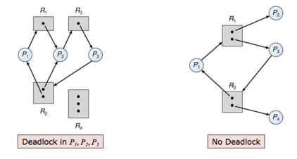
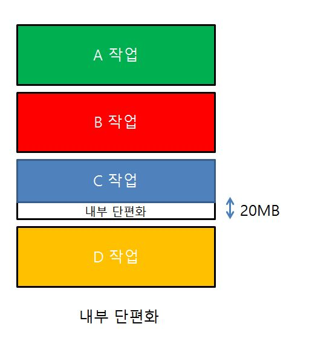

# OS

+ [Process vs Thread](#Process-VS-Thread)
  * Process + PCB
  * Thread
  * Multi-Thread vs Multi-Process
+ [Synchronization](#Synchronization)
  - 뮤텍스
  - 세마포어
  - 스핀락
  - 모니터
+ [DeadLock](#DeadLock)
+ 메모리 관리 기법
  - [페이징](#페이징)
  - [세그멘테이션](#세그멘테이션)
+ [OSI 7계층](#OSI-7계층)

## Process VS Thread
### 프로세스 + PCB

- 프로그램을 구동하여 프로그램이 메모리 상에서 실행되는 작업 단위
- OS로부터 주소 공간, 파일, 메모리 등을 할당받음

#### 프로세스 구조

- Code: 실행 프로그램의 코드 영역 및 PC(Program Counter, 다음번 실행될 명령어의 주소를 가지고 있는 레지스터) 저장
- Data: 프로그램 전역변수 & 정적변수 저장
- Heap: 동적으로 메모리 공간을 할당했을 시 저장되는 부분
  + 낮은 주소 -> 높은 주소(FIFO)
- Stack: 매개변수, 복귀 주소 및 로컬 변수 같은 임시 자료를 저장하는 부분
  + 높은 주소 -> 낮은 주소(LIFO)

#### PCB(Process Control Block)
- **특정 프로세스에 대한 중요 정보**를 저장하고 있는 운영 체제의 자료 구조
- 프로세스 생성과 동시에 고유한 PCB 생성
- 프로세스 전환 발생 시 작업 내용을 PCB에 저장, 이후 다시 CPU 할당 시 PCB에 저장된 내용을 불러와 다시 작업 수행
- PCB 저장 내용
  1. 프로그램 식별자(PID): 프로세스 식별번호
  2. 프로세스 상태: new, ready, running, waiting, terminated 등의 상태 저장
  3. 프로그램 카운터: 프로세스가 다음에 실행할 명령어 주소
  4. CPU 레지스터
  5. CPU 스케쥴링 정보: 프로세스 우선순위, 스케쥴 큐에 대한 포인터 등
  6. 메모리 관리 정보: 페이지 테이블 또는 세그먼트 테이블 같은 정보 포함
  7. 입출력 상태 정보: 프로세스에 할당된 입출력 장치들 및 열린 파일 목록
  8. 어카운팅 정보: 사용된 CPI 시간, 시간 제한, 계정 정보 포함

### 스레드(Thread)

- 프로세스 실행 단위
- 구성 요소
  1. 스레드 ID
  2. 프로그램 카운터(PC): 프로세스가 다음에 실행할 명령어 주소 저장
  3. 레지스터 집합들
  4. 스택: 함수 내 선언 변수, 복귀 주소, 매개변수 등 임시 변수 저장
- 서로 독립적인 스택을 가짐으로써 독립적인 함수 호출 및 실행 흐름을 가지는 것이 가능해짐

### Multi-Thread vs Multi-process
#### 멀티 스레딩
- 장점
  + 스레드 간의 통신이 필요한 경우 별도 자원을 사용하지 않고 공유하는 **Heap 영역**을 통해 데이터를 주고 받을 수 있어 **통신 방법이 훨씬 간단함.**
  + Context Switching의 경우 캐시 메모리를 비울 필요가 없어 매우 빠름
  + 시스템의 throughput이 향상되고 자원 소모가 줄어들며 응답시간이 빨라짐
- 단점
  + 서로 다른 스레드가 같은 힙 영역을 공유하기 때문에 다른 스레드가 사용 중인 자원에 접근해 엉뚱한 값을 읽거나  수정 가능
  + 이 때문에 **동기화** 작업 필요, 하지만 이로 인해 **병목 현상** 발생
  + 오류로 하나의 스레드가 종료 시 전체 스레드가 종료될 수 있음

#### 멀티 프로세싱
- 장점
  + 서로 독립된 프로세스에서 실행되므로 하나가 죽더라고 다른 프로세스에 영향을 끼치지 않음
- 단점
  + 많은 메모리 공간 및 CPU 시간 차지
  + Context Switching시 캐시 메모리를 비워야 함

#### 결론
- 속도가 빠른 것이 중요시될 시 멀티스레딩이 더 좋지만 공유 자원에 여러 스레드가 접근하는 경우가 많은 경우 오류가 발생할 가능성이 높아지므로 멀티 프로세스를 사용하는 것이 더 나을 수도 있음.
- 상황에 따라(안전 vs 속도) 적절한 동작 방식을 선택할 필요.

## Synchronization
### 정의
- 여러 프로세스 or 스레드가 공유하는 **자원의 일관성**을 유지하기 위한 활동
- 동기화가 없다면 Race Condition(2개 이상의 프로세스가 공통 자원을 병행하면서 읽을 시 순서에 따라 결과가 달라지는 현상)이 발생해 일관성이 깨진다.

### 임계 영역
- Critical Section: 실행 코드 중에 공유 데이터로 접근하는 코드
- 이 부분을 **동기화**를 통해 일관성을 유지시켜야 한다
- 임계 영역 문제 해결 충족 조건
  1. Mutual Exclusion(상호 배제): 하나의 프로세스가 임계 영역에 있으면 다른 프로세스는 못 들어간다
  2. Progress(진행): 임계 영역을 차지하는 프로세스가 없을 시 새로운 프로세스가 접근하면 들여보내준다
  3. Bounded Waiting(유한 대기): 임계 영역에 접근 요청 후 이가 받아들여질 때 까지의 시간은 유한해야 함

### 뮤텍스

- MUTual EXclusion(상호 배제)의 약자
- **오직 하나**의 프로세스(스레드)만이 동일 시점에서 뮤텍스를 얻어 임계 영역 입장
- 임계 영역에 들어온 스레드만 락 해제 가능

### 세마포어

- Lock을 걸지 않은 스레드도 Signal을 보내 락 해제 가능
- Wait & Signal 사용
  + wait 호출 시 세마포어 카운트 1 내림
  + signal 호출 시 카운트 1 증가
  + 카운트가 0보다 작아질 시 lock 실행
- 만약 초기 세마포어 카운트는 1로 설정 했을 시 뮤텍스와 같음, 즉 세마포어는 **뮤텍스가 될 수 있음**

### 스핀락

- 다른 스레드가 Lock 소유 시 Sleep 하는 대신 lock가 반환될 때까지 계속 확인
- 보통 sleep하는 과정에서 context switching이 발생하므로 스핀락은 아주 작업에 대해 효율적이라 할 수 있음
- 하지만 얻을 때 까지 계속 돌리므로 Busy Waiting 문제로 CPU 오버헤드가 발생할 수 있는 문제점

### 모니터

- 현재 많이 사용되고 있는 동기화 도구로, 세마포어보어 고수준 개념으로 알려져 있고 주로 Java에 사용됨
- 배타 동기, 조건 동기 이 2가지 Queue를 가짐
- 배타동기 Queue는 Synchronized 키워드를 통해 호출
- 조건동기 Queue는 wait(), notify(), notifyAll()로 호출
- 세마포어보다 코딩이 훨씬 쉬운데, 이는 항상 스레드가 들어오고 나가는 걸 명시해줘야하는 세마포어와 다르게 Synchronized 키워드만 붙이면 알아서 조절해준다.

## DeadLock

- 프로세스가 자원을 얻지 못해 다음 처리를 못하는 상태
- 시스템이 한정된 자원을 여러 곳에서 사용하려고 시도 시 발생

### 발생 조건
1. 상호 배제(Mutual Exclusion): 자원은 한 번에 한 프로세스에만 사용 가능
2. 점유 대기(Hold and Wait): 프로세스는 최소한 하나의 자원을 점유함, 다른 프로세스에 할당되어 사용하는 자원을 추가로 점유하기 위해 대기하는 프로세스 존재
3. 비선점(No Preemption): 프로세스에 할당된 자원은 사용이 종료될 때까지 강제로 못 뺏음
4. 순환 대기(Circular Wait): 프로세스 집합에서 순환 형태로 자원 대기

-> 이 4가지 조건이 모두 만족해야 데드락 발생, 하나라도 성립하지 않는다면 해결 가능

### 해결 방법
- 예방(Prevention): 교착 상태 중 하나를 제거해 해결하는 방법, 이는 자원 낭비가 매우 심하다고 한다
- 회피(Avoidance): 교착 발생 시 피하는 방법으로, 대표적으로 **은행원 알고리즘**이 존재
  + 은행원 알고리즘
    * 프로세스가 자원을 요구할 시 자원 할당 후에도 **안정 상태**가 유지되는지를 확인하며 이것이 유지되면 할당되고 아니면 거절 및 대기
    * 수행되기 위한 3가지 도구
    1. Max: 각 프로세스가 자원을 얼마나 요청 가능한지
    2. Allocated: 각 프로세스가 현재 보유하고 있는 자원은 얼마인지
    3. Available: 시스템이 얼마나 자원을 보유하고 있는지
    * 여기서 자원을 할당 요청받았을 시 그 요청을 받을 시 안정 상태 및 불안정 상태를 확인하고 여부에 따라 할당해줄지 거절할지 결정

- 탐지 및 회복(Detection): 자원 할당 그래프를 통해 교착 상태를 탐지
  + 자원 할당 그래프

    

    * 동그라미는 프로세스, 네모는 리소스
    * 프로세스 -> 리소스: 리소스 할당 요청
    * 리소스 -> 프로세스: 리소스 할당된 상태
    * 이 상태에서 사이클이 일어나고 자원의 유형이 하나밖에 없다면 교착 상태

- 회복: 교착 상태가 일어난 프로세스를 종료하거나 교착 상태의 프로세스들을 자원 선점해 회복 시도
  + 종료 방법
  1. 모두 종료
  2. 교착 상태가 제거될 때까지 하나씩 종료
  + 자원 선점 방법
  1. 해당 프로세스를 일시 정지한 후 자원을 선점해 다른 프로세스에 할당
  2. 우선순위가 낮거나 수행 횟수가 적은 프로세스 위주로 선점

## 메모리 관리 기법
- 각각의 프로세스는 독립된 메모리 공간을 가지며, 다른 프로세스 및 OS의 메모리 공간에 단독 접근 불가, OS는 예외적으로 이러한 제약이 없음

### 메모리 낭비 방지 방법
1. 동적 적재(Dynamic Loading): 프로그램 실행에 반드시 필요한 루틴 및 데이터만 적재하고, 필요 시에 해당 부분을 동적으로 메모리에 적재
2. 동적 연결(Dynamic Linking): 라이브러리 루틴 연결을 컴파일 시점이 아닌 실행  시점까지 미루는 기법
3. 스와핑(Swapping):  CPU에서 실행되지 않는 프로세스는 저장장치의 Swap 영역으로 이동해 메모리 확보, 이 과정에서 큰 전송시간이 필요하기 때문에 메모리 공간이 부족할 때 사용

### 단편화
- 프로세스들이 메모리에 적재되고 제거되는 일이 반복되면 프로세스들이 차지하는 메모리 틈 사이에 사용하지 못할 만큼 작은 자유공간들이 늘어나는 것
  + 내부 단편화
    - 프로세스가 hole 안에 들어가면서 사용하지 못하게 되는 용량 부분

    

  + 외부 단편화
    - 메모리 공간 중 사용하지 못하게 되는 부분 발생

    

  + 압축
    - 위 공간들을 합치면 충분한 공간이 생기는 경우 이것들을 한 쪽으로 몰아 자유 공간을 확보하는 방법론, 효율이 좋지 않음

### 메모리 관리 전략
- 연속 메모리 할당(Continuous Memory Allocation)
  - 프로세스를 메모리에 연속적으로 할당
  - 할당 및 제거를 반복하다보면 Scattered Holes가 발생해 외부 단편화가 발생, 매우 비효율적

#### 페이징

#### 세그멘테이션

## OSI 7계층
