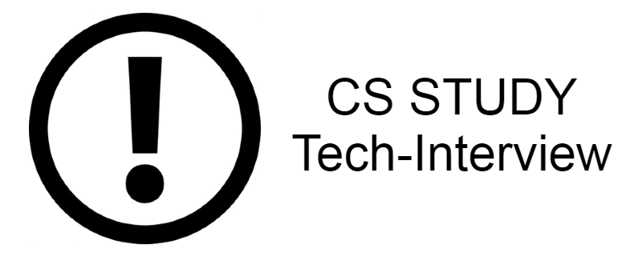

# CS-Interview-Study

---
## 목차
- [목적](#목적)
- [기본 CS 지식](#기본-CS-지식)
  * [Network](./Network/README.md)
  * [Database](./Database/README.md)
  * [OS](./OS/README.md)
  * [Data Structure](./DataStructure/README.md)
  * [Algorithm](./Algorithm/README.md)
- [포트폴리오 관련 지식](#포트폴리오-관련-지식)
  * [Java](./Java/README.md)
  * [Design Pattern(Head First Design Patterns 정리)](./DesignPattern/README.md) - 정리 중
  * [Android](./Android/README.md) - 정리 중
  * [사용 라이브러리](./Library/README.md) - 정리 중
- [참고 사이트](#참고-사이트)
---
## 목적
- CS 관련 지식 습득 및 관련 정보를 정리해서 기술 면접에 도움이 되기 위한 목적으로 만듦

## 기본 CS 지식

### Network [Link](./Network/README.md)
+ OSI 7계층
+ HTTP 관련: HTTP vs HTTPS / HTTP 1.1 vs 2.0 vs 3.0 / RESTful/ HTTP 응답코드
+ 웹브라우저에 google.com을 쳤을 때 일어나는 일
+ TCP vs UDP

### Database [Link](./Database/README.md)
+ 데이터베이스
+ 트랜잭션
+ DB 인덱스

### OS [Link](./OS/README.md)
+ Process + PCB / Thread
  * Multi-Thread vs Multi-Process
+ Synchronization
+ DeadLock
+ 메모리 관리 기법
  - 페이징
  - 세그멘테이션
+ 가상 메모리

### Data Structure [Link](./DataStructure/README.md)
+ Map VS HashMap
+ List VS Array
  * 단방향 vs 양방향 linked-list
+ Stack VS Queue
  * Stack 2개로 Queue 구현

### Algorithm [Link](./Algorithm/README.md)
+ Sorting
+ DFS / BFS
+ 다익스트라
+ MST
+ DP / Bitmasking
---
## 포트폴리오 관련 지식
### Java [Link](./Java/README.md)
+ 객체지향 VS 절차지향
+ 객체지향 특징
+ JVM, GC 설명
+ SOLID
+ Overriding vs Overloading
+ Interface vs Abstract class

### Design Pattern [Link](./DesignPattern/README.md)

### Android [Link](./Android/README.md)
+ 매니페스트 파일
+ 대표 컴포넌트
+ Activity, Fragment - Lifecycle
+ RecyclerView
+ ViewPager
+ Handler / Looper
+ RxJava

### 라이브러리 [Link](./Library/README.md)
+ Retrofit2
+ POI
+ MPAndroidChart

---
## 참고 사이트
- https://github.com/JaeYeopHan/Interview_Question_for_Beginner#
- https://garden1500.tistory.com/m/11?category=0
